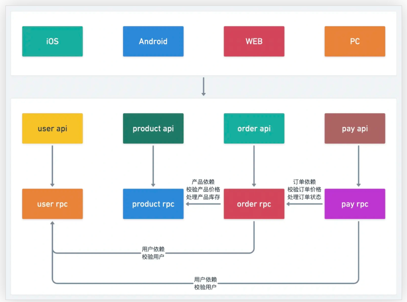

# Go-Zero商城微服务

基础工具安装：

```shell
# go
go version		# go version go1.25.8 linux/amd64

# protoc
unzip protoc-34.1-linux-x86_64.zip -d protoc
sudo mv protoc/bin/protoc /usr/local/bin/
sudo mv protoc/include/* /usr/local/include/
protoc --version		#libprotoc 34.1

# protoc-gen-go
go install google.golang.org/protobuf/cmd/protoc-gen-go@latest
protoc-gen-go --version		#protoc-gen-go v1.36.11

# protoc-gen-go-grpc
go install google.golang.org/grpc/cmd/protoc-gen-go-grpc@latest
protoc-gen-go-grpc --version		#protoc-gen-go-grpc 1.6.1

# goctl
go install github.com/zeromicro/go-zero/tools/goctl@latest
goctl --version		#goctl version 1.10.1 linux/amd64

# path配置
echo "PATH=$PATH:$(go env GOPATH)/bin" >> ~/.bashrc
source ~/.bashrc

# mysql redis
sudo apt install -y mysql-server redis-server etcd-server
sudo systemctl enable --now mysql redis-server etcd
```


## 服务拆分概述

一个商城项目可拆分为以下服务：

- 用户服务
- 订单服务
- 产品服务
- 支付服务
- 售后服务

每个服务都可以再分为 **`api` 服务**和 **`rpc` 服务**：

- **api 服务**：对外，可提供给 app 调用
- **rpc 服务**：对内，可提供给内部 api 服务或者其他 rpc 服务调用

## 各服务详细拆分

1. 用户服务


| api 服务 | 端口：8000   | rpc 服务 | 端口：9000   |
| -------- | ------------ | -------- | ------------ |
| login    | 用户登录接口 | login    | 用户登录接口 |
| register | 用户注册接口 | register | 用户注册接口 |
| userinfo | 用户信息接口 | userinfo | 用户信息接口 |
| …        | …            | …        | …            |

2. 产品服务


| api 服务 | 端口：8001   | rpc 服务 | 端口：9001   |
| -------- | ------------ | -------- | ------------ |
| create   | 产品创建接口 | create   | 产品创建接口 |
| update   | 产品修改接口 | update   | 产品修改接口 |
| remove   | 产品删除接口 | remove   | 产品删除接口 |
| detail   | 产品详情接口 | detail   | 产品详情接口 |
| …        | …            | …        | …            |

3. 订单服务


| api 服务 | 端口：8002   | rpc 服务 | 端口：9002   |
| -------- | ------------ | -------- | ------------ |
| create   | 订单创建接口 | create   | 订单创建接口 |
| update   | 订单修改接口 | update   | 订单修改接口 |
| remove   | 订单删除接口 | remove   | 订单删除接口 |
| detail   | 订单详情接口 | detail   | 订单详情接口 |
| list     | 订单列表接口 | list     | 订单列表接口 |
|          |              | paid     | 订单支付接口 |
| …        | …            | …        | …            |

4. 支付服务


| api 服务 | 端口：8003   | rpc 服务 | 端口：9003   |
| -------- | ------------ | -------- | ------------ |
| create   | 支付创建接口 | create   | 支付创建接口 |
| detail   | 支付详情接口 | detail   | 支付详情接口 |
| callback | 支付回调接口 | callback | 支付回调接口 |
| …        | …            | …        | …            |

## 创建项目目录

创建 mall 工程

```shell
mkdir mall && cd mallgo mod init mall
```

创建 common 目录

```shell
mkdir common
```

创建 service 目录

```shell
mkdir service && cd service
```

创建各服务目录结构

```shell
# 用户服务
mkdir -p {user/api,user/rpc,user/model}

# 产品服务
mkdir -p {product/api,product/rpc,product/model}

# 订单服务
mkdir -p {order/api,order/rpc,order/model}

# 支付服务
mkdir -p {pay/api,pay/rpc,pay/model}
```

最终项目目录结构

```
├── common           # 通用库
├── service          # 服务
│   ├── order
│   │   ├── api      # order api 服务
│   │   ├── model    # order 数据模型
│   │   └── rpc      # order rpc 服务
│   ├── pay
│   │   ├── api      # pay api 服务
│   │   ├── model    # pay 数据模型
│   │   └── rpc      # pay rpc 服务
│   ├── product
│   │   ├── api      # product api 服务
│   │   ├── model    # product 数据模型
│   │   └── rpc      # product rpc 服务
│   └── user
│       ├── api      # user api 服务
│       ├── model    # user 数据模型
│       └── rpc      # user rpc 服务
└── go.mod
```

## 服务结构



## 用户服务（user）

进入服务工作区

```
cd mall/service/user
```

### 生成 user model 模型

创建 sql 文件

```
vim model/user.sql
```

编写 sql 文件

```
CREATE TABLE `user` (
  `id` bigint unsigned NOT NULL AUTO_INCREMENT,
  `name` varchar(255)  NOT NULL DEFAULT '' COMMENT '用户姓名',
  `gender` tinyint(3) unsigned NOT NULL DEFAULT '0' COMMENT '用户性别',
  `mobile` varchar(255)  NOT NULL DEFAULT '' COMMENT '用户电话',
  `password` varchar(255)  NOT NULL DEFAULT '' COMMENT '用户密码',
  `create_time` timestamp NULL DEFAULT CURRENT_TIMESTAMP,
  `update_time` timestamp NULL DEFAULT CURRENT_TIMESTAMP ON UPDATE CURRENT_TIMESTAMP,
  PRIMARY KEY (`id`),
  UNIQUE KEY `idx_mobile_unique` (`mobile`)
) ENGINE=InnoDB  DEFAULT CHARSET=utf8mb4;
```

运行模板生成命令

```
goctl model mysql ddl -src ./model/user.sql -dir ./model -c
```

### 生成 user api 服务

创建 api 文件

```
vim api/user.api
```

编写 api 文件

```
type (
  // 用户登录
  LoginRequest {
    Mobile   string `json:"mobile"`
    Password string `json:"password"`
  }
  LoginResponse {
    AccessToken  string `json:"accessToken"`
    AccessExpire int64  `json:"accessExpire"`
  }
  // 用户登录

  // 用户注册
  RegisterRequest {
    Name     string `json:"name"`
    Gender   int64  `json:"gender"`
    Mobile   string `json:"mobile"`
    Password string `json:"password"`
  }
  RegisterResponse {
    Id     int64  `json:"id"`
    Name   string `json:"name"`
    Gender int64  `json:"gender"`
    Mobile string `json:"mobile"`
  }
  // 用户注册

  // 用户信息
  UserInfoResponse {
    Id     int64  `json:"id"`
    Name   string `json:"name"`
    Gender int64  `json:"gender"`
    Mobile string `json:"mobile"`
  }
  // 用户信息
)

service User {
  @handler Login
  post /api/user/login(LoginRequest) returns (LoginResponse)

  @handler Register
  post /api/user/register(RegisterRequest) returns (RegisterResponse)
}

@server(
  jwt: Auth
)
service User {
  @handler UserInfo
  post /api/user/userinfo() returns (UserInfoResponse)
}
```

运行模板生成命令

```
goctl api go -api ./api/user.api -dir ./api
```

### 生成 user rpc 服务

创建 proto 文件

```
vim rpc/user.proto
```

编写 proto 文件

```protobuf
syntax = "proto3";

package user;
option go_package = "./user";

// 用户登录
message LoginRequest {
    string Mobile = 1;
    string Password = 2;
}
message LoginResponse {
    int64 Id = 1;
    string Name = 2;
    int64 Gender = 3;
    string Mobile = 4;
}
// 用户登录

// 用户注册
message RegisterRequest {
    string Name = 1;
    int64 Gender = 2;
    string Mobile = 3;
    string Password = 4;
}
message RegisterResponse {
    int64 Id = 1;
    string Name = 2;
    int64 Gender = 3;
    string Mobile = 4;
}
// 用户注册

// 用户信息
message UserInfoRequest {
    int64 Id = 1;
}
message UserInfoResponse {
    int64 Id = 1;
    string Name = 2;
    int64 Gender = 3;
    string Mobile = 4;
}
// 用户信息

service User {
    rpc Login(LoginRequest) returns(LoginResponse);
    rpc Register(RegisterRequest) returns(RegisterResponse);
    rpc UserInfo(UserInfoRequest) returns(UserInfoResponse);
}
```

运行模板生成命令

```shell
cd rpc
goctl rpc protoc user.proto --go_out=./pb --go-grpc_out=./pb --zrpc_out=.
```

回到 `mall` 项目根目录执行：

```
go mod tidy
```

### 编写 user rpc 服务

#### 修改配置文件

修改 `user.yaml` 配置文件：

```
vim rpc/etc/user.yaml
```

配置内容：

```
Name: user.rpc
ListenOn: 0.0.0.0:9000

Etcd:
  Hosts:
  - etcd:2379
  Key: user.rpc

Mysql:
  DataSource: root:123456@tcp(mysql:3306)/mall?charset=utf8mb4&parseTime=true&loc=Asia%2FShanghai

CacheRedis:
- Host: redis:6379
  Type: node
  Pass:
```

#### 添加 user model 依赖

**添加配置实例化**

文件：`rpc/internal/config/config.go`

```
package config

import (
  "github.com/tal-tech/go-zero/core/stores/cache"
  "github.com/tal-tech/go-zero/zrpc"
)

type Config struct {
  zrpc.RpcServerConf

  Mysql struct {
    DataSource string
  }

  CacheRedis cache.CacheConf
}
```

**注册服务上下文依赖**

文件：`rpc/internal/svc/servicecontext.go`

```
package svc

import (
  "mall/service/user/model"
  "mall/service/user/rpc/internal/config"

  "github.com/tal-tech/go-zero/core/stores/sqlx"
)

type ServiceContext struct {
  Config    config.Config
  UserModel model.UserModel
}

func NewServiceContext(c config.Config) *ServiceContext {
  conn := sqlx.NewMysql(c.Mysql.DataSource)
  return &ServiceContext{
    Config:    c,
    UserModel: model.NewUserModel(conn, c.CacheRedis),
  }
}
```

#### 添加用户注册逻辑 Register

**创建密码加密工具**

文件：`common/cryptx/crypt.go`

```
package cryptx

import (
  "fmt"
  "golang.org/x/crypto/scrypt"
)

func PasswordEncrypt(salt, password string) string {
  dk, _ := scrypt.Key([]byte(password), []byte(salt), 32768, 8, 1, 32)
  return fmt.Sprintf("%x", string(dk))
}
```

**添加 Salt 配置**

在 `rpc/etc/user.yaml` 中添加：

```
Salt: HWVOFkGgPTryzICwd7qnJaZR9KQ2i8xe
```

在 `rpc/internal/config/config.go` 中添加：

```
type Config struct {
  ...
  Salt string
}
```

**实现注册逻辑**

文件：`rpc/internal/logic/registerlogic.go`

```go
package logic

import (
	"context"

	"mall/common/cryptx"
	"mall/service/user/model"
	"mall/service/user/rpc/internal/svc"
	"mall/service/user/rpc/pb/user"

	"github.com/zeromicro/go-zero/core/logx"
	"google.golang.org/grpc/status"
)

var (
	UserExistsErr = status.Error(100, "User has existed")
	UserInsertErr = status.Error(500, "User inserts failed")
	UnkonwnErr    = status.Error(501, "Unexpected errors")
)

type RegisterLogic struct {
	ctx    context.Context
	svcCtx *svc.ServiceContext
	logx.Logger
}

func NewRegisterLogic(ctx context.Context, svcCtx *svc.ServiceContext) *RegisterLogic {
	return &RegisterLogic{
		ctx:    ctx,
		svcCtx: svcCtx,
		Logger: logx.WithContext(ctx),
	}
}

func (l *RegisterLogic) Register(in *user.RegisterRequest) (*user.RegisterResponse, error) {
	// todo: add your logic here and delete this line

	// 判断手机号是否注册
	_, err := l.svcCtx.UserModel.FindOneByMobile(context.Background(), in.Mobile)
	if err == nil {
		return nil, UserExistsErr
	}
	if err == model.ErrNotFound {
		newUser := model.User{
			Name:     in.Name,
			Gender:   uint64(in.Gender),
			Mobile:   in.Mobile,
			Password: cryptx.PasswordEncrypt(l.svcCtx.Config.Salt, in.Password),
		}
		res, err := l.svcCtx.UserModel.Insert(context.Background(), &newUser)
		if err != nil {
			return nil, UserInsertErr
		}

		Id, err := res.LastInsertId()
		newUser.Id = uint64(Id)
		if err != nil {
			return nil, UserInsertErr
		}
		return &user.RegisterResponse{
			Id:     int64(newUser.Id),
			Name:   newUser.Name,
			Gender: int64(newUser.Gender),
			Mobile: newUser.Mobile,
		}, nil
	}

	return nil, UnkonwnErr
}
```

#### 添加用户登录逻辑 Login

文件：`rpc/internal/logic/loginlogic.go`

```
package logic

import (
	"context"

	"mall/common/cryptx"
	"mall/service/user/model"
	"mall/service/user/rpc/internal/svc"
	"mall/service/user/rpc/pb/user"

	"github.com/zeromicro/go-zero/core/logx"
	"google.golang.org/grpc/status"
)

var (
	ErrorPassWordOrMobile = status.Error(100, "Error password or mobile")
)

type LoginLogic struct {
	ctx    context.Context
	svcCtx *svc.ServiceContext
	logx.Logger
}

func NewLoginLogic(ctx context.Context, svcCtx *svc.ServiceContext) *LoginLogic {
	return &LoginLogic{
		ctx:    ctx,
		svcCtx: svcCtx,
		Logger: logx.WithContext(ctx),
	}
}

func (l *LoginLogic) Login(in *user.LoginRequest) (*user.LoginResponse, error) {
	// todo: add your logic here and delete this line
	res, err := l.svcCtx.UserModel.FindOneByMobile(context.Background(), in.Mobile)
	if err != nil {
		if err == model.ErrNotFound {
			return nil, UserExistsErr
		}
		return nil, UnkonwnErr
	}
	pw := cryptx.PasswordEncrypt(l.svcCtx.Config.Salt, in.Password)
	if pw != res.Password {
		return nil, ErrorPassWordOrMobile
	}
	return &user.LoginResponse{
		Id:     int64(res.Id),
		Name:   res.Name,
		Gender: int64(res.Gender),
		Mobile: res.Mobile,
	}, nil
}
```

#### 添加用户信息逻辑 UserInfo

文件：`rpc/internal/logic/userinfologic.go`

```go
package logic

import (
	"context"

	"mall/service/user/model"
	"mall/service/user/rpc/internal/svc"
	"mall/service/user/rpc/pb/user"

	"github.com/zeromicro/go-zero/core/logx"
	"google.golang.org/grpc/status"
)

var (
	UserNotExists = status.Error(100, "User not exists")
)

type UserInfoLogic struct {
	ctx    context.Context
	svcCtx *svc.ServiceContext
	logx.Logger
}

func NewUserInfoLogic(ctx context.Context, svcCtx *svc.ServiceContext) *UserInfoLogic {
	return &UserInfoLogic{
		ctx:    ctx,
		svcCtx: svcCtx,
		Logger: logx.WithContext(ctx),
	}
}

func (l *UserInfoLogic) UserInfo(in *user.UserInfoRequest) (*user.UserInfoResponse, error) {
	// todo: add your logic here and delete this line
	res, err := l.svcCtx.UserModel.FindOne(context.Background(), uint64(in.Id))
	if err != nil {
		if err == model.ErrNotFound {
			return nil, UserNotExists
		}
		return nil, UnkonwnErr
	}
	return &user.UserInfoResponse{
		Id:     int64(res.Id),
		Name:   res.Name,
		Gender: int64(res.Gender),
		Mobile: res.Mobile,
	}, nil
}
```

### 编写 user api 服务

#### 修改配置文件

文件：`api/etc/user.yaml`

```
Name: User
Host: 0.0.0.0
Port: 8000

Mysql:
  DataSource: root:123456@tcp(mysql:3306)/mall?charset=utf8mb4&parseTime=true&loc=Asia%2FShanghai

CacheRedis:
- Host: redis:6379
  Pass:
  Type: node

Auth:
  AccessSecret: uOvKLmVfztaXGpNYd4Z0I1SiT7MweJhl
  AccessExpire: 86400
```

#### 添加 user rpc 依赖

**添加 RPC 服务配置**

在 `api/etc/user.yaml` 中添加：

```
UserRpc:
  Etcd:
    Hosts:
    - etcd:2379
    Key: user.rpc
```

**添加配置实例化**

文件：`api/internal/config/config.go`

```
package config

import (
  "github.com/tal-tech/go-zero/rest"
  "github.com/tal-tech/go-zero/zrpc"
)

type Config struct {
  rest.RestConf

  Auth struct {
    AccessSecret string
    AccessExpire int64
  }

  UserRpc zrpc.RpcClientConf
}
```

**注册服务上下文依赖**

文件：`api/internal/svc/servicecontext.go`

```
package svc

import (
  "mall/service/user/api/internal/config"
  "mall/service/user/rpc/userclient"

  "github.com/tal-tech/go-zero/zrpc"
)

type ServiceContext struct {
  Config config.Config
  UserRpc userclient.User
}

func NewServiceContext(c config.Config) *ServiceContext {
  return &ServiceContext{
    Config:  c,
    UserRpc: userclient.NewUser(zrpc.MustNewClient(c.UserRpc)),
  }
}
```

#### 添加用户注册逻辑 Register

文件：`api/internal/logic/registerlogic.go`

```
package logic

import (
  "context"

  "mall/service/user/api/internal/svc"
  "mall/service/user/api/internal/types"
  "mall/service/user/rpc/userclient"

  "github.com/tal-tech/go-zero/core/logx"
)

type RegisterLogic struct {
  logx.Logger
  ctx    context.Context
  svcCtx *svc.ServiceContext
}

func NewRegisterLogic(ctx context.Context, svcCtx *svc.ServiceContext) RegisterLogic {
  return RegisterLogic{
    Logger: logx.WithContext(ctx),
    ctx:    ctx,
    svcCtx: svcCtx,
  }
}

func (l *RegisterLogic) Register(req types.RegisterRequest) (resp *types.RegisterResponse, err error) {
  res, err := l.svcCtx.UserRpc.Register(l.ctx, &userclient.RegisterRequest{
    Name:     req.Name,
    Gender:   req.Gender,
    Mobile:   req.Mobile,
    Password: req.Password,
  })
  if err != nil {
    return nil, err
  }

  return &types.RegisterResponse{
    Id:     res.Id,
    Name:   res.Name,
    Gender: res.Gender,
    Mobile: res.Mobile,
  }, nil
}
```

#### 添加用户登录逻辑 Login

**创建 JWT 工具**

文件：`common/jwtx/jwt.go`

```
package jwtx

import "github.com/golang-jwt/jwt"

func GetToken(secretKey string, iat, seconds, uid int64) (string, error) {
  claims := make(jwt.MapClaims)
  claims["exp"] = iat + seconds
  claims["iat"] = iat
  claims["uid"] = uid
  token := jwt.New(jwt.SigningMethodHS256)
  token.Claims = claims
  return token.SignedString([]byte(secretKey))
}
```

**实现登录逻辑**

文件：`api/internal/logic/loginlogic.go`

```
package logic

import (
  "context"
  "time"

  "mall/common/jwtx"
  "mall/service/user/api/internal/svc"
  "mall/service/user/api/internal/types"
  "mall/service/user/rpc/userclient"

  "github.com/tal-tech/go-zero/core/logx"
)

type LoginLogic struct {
  logx.Logger
  ctx    context.Context
  svcCtx *svc.ServiceContext
}

func NewLoginLogic(ctx context.Context, svcCtx *svc.ServiceContext) LoginLogic {
  return LoginLogic{
    Logger: logx.WithContext(ctx),
    ctx:    ctx,
    svcCtx: svcCtx,
  }
}

func (l *LoginLogic) Login(req types.LoginRequest) (resp *types.LoginResponse, err error) {
  res, err := l.svcCtx.UserRpc.Login(l.ctx, &userclient.LoginRequest{
    Mobile:   req.Mobile,
    Password: req.Password,
  })
  if err != nil {
    return nil, err
  }

  now := time.Now().Unix()
  accessExpire := l.svcCtx.Config.Auth.AccessExpire

  accessToken, err := jwtx.GetToken(l.svcCtx.Config.Auth.AccessSecret, now, accessExpire, res.Id)
  if err != nil {
    return nil, err
  }

  return &types.LoginResponse{
    AccessToken:  accessToken,
    AccessExpire: now + accessExpire,
  }, nil
}
```

#### 添加用户信息逻辑 UserInfo

文件：`api/internal/logic/userinfologic.go`

```
package logic

import (
  "context"
  "encoding/json"

  "mall/service/user/api/internal/svc"
  "mall/service/user/api/internal/types"
  "mall/service/user/rpc/userclient"

  "github.com/tal-tech/go-zero/core/logx"
)

type UserInfoLogic struct {
  logx.Logger
  ctx    context.Context
  svcCtx *svc.ServiceContext
}

func NewUserInfoLogic(ctx context.Context, svcCtx *svc.ServiceContext) UserInfoLogic {
  return UserInfoLogic{
    Logger: logx.WithContext(ctx),
    ctx:    ctx,
    svcCtx: svcCtx,
  }
}

func (l *UserInfoLogic) UserInfo() (resp *types.UserInfoResponse, err error) {
  uid, _ := l.ctx.Value("uid").(json.Number).Int64()
  res, err := l.svcCtx.UserRpc.UserInfo(l.ctx, &userclient.UserInfoRequest{
    Id: uid,
  })
  if err != nil {
    return nil, err
  }

  return &types.UserInfoResponse{
    Id:     res.Id,
    Name:   res.Name,
    Gender: res.Gender,
    Mobile: res.Mobile,
  }, nil
}
```

> **提示**：通过 `l.ctx.Value("uid")` 可获取 jwt token 中自定义的参数

### 启动 user rpc 服务

```
~/mall/service/user/rpcgo run user.go -f etc/user.yaml 
Starting rpc server at 0.0.0.0:9000...
```

### 启动 user api 服务

```shell
sudo vim /etc/hosts		#127.0.0.1 etcd
xin@u:~/mall/service/user/apigo run user.go -f etc/user.yaml 
Starting server at 0.0.0.0:8000...
```

## 产品服务

### 进入服务工作区

```
cd mall/service/product
```

### 生成 product model 模型

#### 创建 sql 文件

```
vim model/product.sql
```

#### 编写 sql 文件

```
CREATE TABLE `product` (
  `id` bigint unsigned NOT NULL AUTO_INCREMENT,
  `name` varchar(255)  NOT NULL DEFAULT '' COMMENT '产品名称',
  `desc` varchar(255)  NOT NULL DEFAULT '' COMMENT '产品描述',
  `stock` int(10) unsigned NOT NULL DEFAULT '0' COMMENT '产品库存',
  `amount` int(10) unsigned NOT NULL DEFAULT '0'  COMMENT '产品金额',
  `status` tinyint(3) unsigned NOT NULL DEFAULT '0' COMMENT '产品状态 0-下架 1-上架',
  `create_time` timestamp NULL DEFAULT CURRENT_TIMESTAMP,
  `update_time` timestamp NULL DEFAULT CURRENT_TIMESTAMP ON UPDATE CURRENT_TIMESTAMP,
  PRIMARY KEY (`id`)
) ENGINE=InnoDB  DEFAULT CHARSET=utf8mb4;
```

#### 运行模板生成命令

```
goctl model mysql ddl -src ./model/product.sql -dir ./model -c
```

### 生成 product api 服务

#### 创建 api 文件

```
vim api/product.api
```

#### 编写 api 文件

```
type (
  // 产品创建
  CreateRequest {
    Name   string `json:"name"`
    Desc   string `json:"desc"`
    Stock  int64  `json:"stock"`
    Amount int64  `json:"amount"`
    Status int64  `json:"status"`
  }
  CreateResponse {
    Id     int64  `json:"id"`
    Name   string `json:"name"`
    Desc   string `json:"desc"`
    Stock  int64  `json:"stock"`
    Amount int64  `json:"amount"`
    Status int64  `json:"status"`
  }
  // 产品创建

  // 产品修改
  UpdateRequest {
    Id     int64  `json:"id"`
    Name   string `json:"name,optional"`
    Desc   string `json:"desc,optional"`
    Stock  int64  `json:"stock,optional"`
    Amount int64  `json:"amount,optional"`
    Status int64  `json:"status,optional"`
  }
  UpdateResponse {
    Id     int64  `json:"id"`
    Name   string `json:"name"`
    Desc   string `json:"desc"`
    Stock  int64  `json:"stock"`
    Amount int64  `json:"amount"`
    Status int64  `json:"status"`
  }
  // 产品修改

  // 产品删除
  RemoveRequest {
    Id int64 `json:"id"`
  }
  RemoveResponse {
    Id int64 `json:"id"`
  }
  // 产品删除

  // 产品详情
  DetailRequest {
    Id int64 `json:"id"`
  }
  DetailResponse {
    Id     int64  `json:"id"`
    Name   string `json:"name"`
    Desc   string `json:"desc"`
    Stock  int64  `json:"stock"`
    Amount int64  `json:"amount"`
    Status int64  `json:"status"`
  }
  // 产品详情
)

@server(
  jwt: Auth
)
service Product {
  @handler Create
  post /api/product/create(CreateRequest) returns (CreateResponse)

  @handler Update
  post /api/product/update(UpdateRequest) returns (UpdateResponse)

  @handler Remove
  post /api/product/remove(RemoveRequest) returns (RemoveResponse)

  @handler Detail
  post /api/product/detail(DetailRequest) returns (DetailResponse)
}
```

#### 运行模板生成命令

```
goctl api go -api ./api/product.api -dir ./api
```

### 生成 product rpc 服务

#### 创建 proto 文件

```
vim rpc/product.proto
```

#### 编写 proto 文件

```
syntax = "proto3";

package productclient;

option go_package = "product";

// 产品创建
message CreateRequest {
    string Name = 1;
    string Desc = 2;
    int64 Stock = 3;
    int64 Amount = 4;
    int64 Status = 5;
}
message CreateResponse {
    int64 Id = 1;
    string Name = 2;
    string Desc = 3;
    int64 Stock = 4;
    int64 Amount = 5;
    int64 Status = 6;
}
// 产品创建

// 产品修改
message UpdateRequest {
    int64 Id = 1;
    string Name = 2;
    string Desc = 3;
    int64 Stock = 4;
    int64 Amount = 5;
    int64 Status = 6;
}
message UpdateResponse {
    int64 Id = 1;
    string Name = 2;
    string Desc = 3;
    int64 Stock = 4;
    int64 Amount = 5;
    int64 Status = 6;
}
// 产品修改

// 产品删除
message RemoveRequest {
    int64 Id = 1;
}
message RemoveResponse {
    int64 Id = 1;
}
// 产品删除

// 产品详情
message DetailRequest {
    int64 Id = 1;
}
message DetailResponse {
    int64 Id = 1;
    string Name = 2;
    string Desc = 3;
    int64 Stock = 4;
    int64 Amount = 5;
    int64 Status = 6;
}
// 产品详情

service Product {
    rpc Create(CreateRequest) returns(CreateResponse);
    rpc Update(UpdateRequest) returns(UpdateResponse);
    rpc Remove(RemoveRequest) returns(RemoveResponse);
    rpc Detail(DetailRequest) returns(DetailResponse);
}
```

#### 运行模板生成命令

```
goctl rpc protoc product.proto --go_out=./pb --go-grpc_out=./pb --zrpc_out=.
```

#### 添加下载依赖包

回到 `mall` 项目根目录执行：

```
go mod tidy
```

### 编写 product rpc 服务

#### 修改配置文件

修改 `product.yaml` 配置文件：

```
vim rpc/etc/product.yaml
```

配置内容：

```
Name: product.rpc
ListenOn: 0.0.0.0:9001

Etcd:
  Hosts:
  - etcd:2379
  Key: product.rpc

Mysql:
  DataSource: root:123456@tcp(mysql:3306)/mall?charset=utf8mb4&parseTime=true&loc=Asia%2FShanghai

CacheRedis:
- Host: redis:6379
  Type: node
  Pass:
```

#### 添加 product model 依赖

**添加配置实例化**

文件：`rpc/internal/config/config.go`

```
package config

import (
  "github.com/tal-tech/go-zero/core/stores/cache"
  "github.com/tal-tech/go-zero/zrpc"
)

type Config struct {
  zrpc.RpcServerConf

  Mysql struct {
    DataSource string
  }

  CacheRedis cache.CacheConf
}
```

**注册服务上下文依赖**

文件：`rpc/internal/svc/servicecontext.go`

```
package svc

import (
  "mall/service/product/model"
  "mall/service/product/rpc/internal/config"

  "github.com/tal-tech/go-zero/core/stores/sqlx"
)

type ServiceContext struct {
  Config      config.Config
  ProductModel model.ProductModel
}

func NewServiceContext(c config.Config) *ServiceContext {
  conn := sqlx.NewMysql(c.Mysql.DataSource)
  return &ServiceContext{
    Config:      c,
    ProductModel: model.NewProductModel(conn, c.CacheRedis),
  }
}
```

#### 添加产品创建逻辑 Create

文件：`rpc/internal/logic/createlogic.go`

```go
package logic

import (
	"context"

	"mall/service/product/model"
	"mall/service/product/rpc/internal/svc"
	"mall/service/product/rpc/pb/product"

	"github.com/zeromicro/go-zero/core/logx"
	"google.golang.org/grpc/status"
)

var (
	UnknownErr = status.Error(500, "Unexcepted error")
)

type CreateLogic struct {
	ctx    context.Context
	svcCtx *svc.ServiceContext
	logx.Logger
}

func NewCreateLogic(ctx context.Context, svcCtx *svc.ServiceContext) *CreateLogic {
	return &CreateLogic{
		ctx:    ctx,
		svcCtx: svcCtx,
		Logger: logx.WithContext(ctx),
	}
}

func (l *CreateLogic) Create(in *product.CreateRequest) (*product.CreateResponse, error) {
	// todo: add your logic here and delete this line
	newProduct := &model.Product{
		Name:   in.Name,
		Desc:   in.Desc,
		Stock:  uint64(in.Stock),
		Amount: uint64(in.Amount),
		Status: uint64(in.Status),
	}
	res, err := l.svcCtx.ProductModel.Insert(context.Background(), newProduct)
	if err != nil {
		return nil, UnknownErr
	}
	Id, err := res.LastInsertId()
	if err != nil {
		return nil, UnknownErr
	}
	newProduct.Id = uint64(Id)
	return &product.CreateResponse{
		Id:     int64(newProduct.Id),
		Name:   newProduct.Name,
		Desc:   newProduct.Desc,
		Stock:  int64(newProduct.Stock),
		Amount: int64(newProduct.Amount),
		Status: int64(newProduct.Status),
	}, nil
}
```

#### 添加产品修改逻辑 Update

文件：`rpc/internal/logic/updatelogic.go`

```
package logic

import (
	"context"

	"mall/service/product/model"
	"mall/service/product/rpc/internal/svc"
	"mall/service/product/rpc/pb/product"

	"github.com/zeromicro/go-zero/core/logx"
	"google.golang.org/grpc/status"
)

var (
	NotExistsErr = status.Error(100, "product does not exist")
	UpdateErr    = status.Error(100, "Update product failed")
)

type UpdateLogic struct {
	ctx    context.Context
	svcCtx *svc.ServiceContext
	logx.Logger
}

func NewUpdateLogic(ctx context.Context, svcCtx *svc.ServiceContext) *UpdateLogic {
	return &UpdateLogic{
		ctx:    ctx,
		svcCtx: svcCtx,
		Logger: logx.WithContext(ctx),
	}
}

func (l *UpdateLogic) Update(in *product.UpdateRequest) (*product.UpdateResponse, error) {
	// todo: add your logic here and delete this line
	res, err := l.svcCtx.ProductModel.FindOne(context.Background(), uint64(in.Id))
	if err != nil {
		if err == model.ErrNotFound {
			return nil, NotExistsErr
		}
		return nil, UnknownErr
	}
	if in.Name != "" {
		res.Name = in.Name
	}
	if in.Desc != "" {
		res.Desc = in.Desc
	}
	if in.Stock != 0 {
		res.Stock = uint64(in.Stock)
	}
	if in.Amount != 0 {
		res.Amount = uint64(in.Amount)
	}
	if in.Status != 0 {
		res.Status = uint64(in.Status)
	}

	err = l.svcCtx.ProductModel.Update(context.Background(), res)
	if err != nil {
		return nil, UpdateErr
	}

	return &product.UpdateResponse{
		Id:     int64(res.Id),
		Name:   res.Name,
		Desc:   res.Desc,
		Stock:  int64(res.Status),
		Amount: int64(res.Amount),
		Status: int64(res.Status),
	}, nil
}
```

#### 添加产品删除逻辑 Remove

文件：`rpc/internal/logic/removelogic.go`

```
package logic

import (
	"context"

	"mall/service/product/model"
	"mall/service/product/rpc/internal/svc"
	"mall/service/product/rpc/pb/product"

	"github.com/zeromicro/go-zero/core/logx"
	"google.golang.org/grpc/status"
)

var (
	DeleteErr = status.Error(100, "Delete product failed")
)

type RemoveLogic struct {
	ctx    context.Context
	svcCtx *svc.ServiceContext
	logx.Logger
}

func NewRemoveLogic(ctx context.Context, svcCtx *svc.ServiceContext) *RemoveLogic {
	return &RemoveLogic{
		ctx:    ctx,
		svcCtx: svcCtx,
		Logger: logx.WithContext(ctx),
	}
}

func (l *RemoveLogic) Remove(in *product.RemoveRequest) (*product.RemoveResponse, error) {
	// todo: add your logic here and delete this line
	_, err := l.svcCtx.ProductModel.FindOne(context.Background(), uint64(in.Id))
	if err != nil {
		if err == model.ErrNotFound {
			return nil, NotExistsErr
		}
		return nil, UnknownErr
	}

	err = l.svcCtx.ProductModel.Delete(context.Background(), uint64(in.Id))
	if err != nil {
		return nil, DeleteErr
	}
	return &product.RemoveResponse{
		Id: in.Id,
	}, nil
}

```

#### 添加产品详情逻辑 Detail

文件：`rpc/internal/logic/detaillogic.go`

```
package logic

import (
	"context"

	"mall/service/product/model"
	"mall/service/product/rpc/internal/svc"
	"mall/service/product/rpc/pb/product"

	"github.com/zeromicro/go-zero/core/logx"
)

type DetailLogic struct {
	ctx    context.Context
	svcCtx *svc.ServiceContext
	logx.Logger
}

func NewDetailLogic(ctx context.Context, svcCtx *svc.ServiceContext) *DetailLogic {
	return &DetailLogic{
		ctx:    ctx,
		svcCtx: svcCtx,
		Logger: logx.WithContext(ctx),
	}
}

func (l *DetailLogic) Detail(in *product.DetailRequest) (*product.DetailResponse, error) {
	// todo: add your logic here and delete this line
	res, err := l.svcCtx.ProductModel.FindOne(context.Background(), uint64(in.Id))
	if err != nil {
		if err == model.ErrNotFound {
			return nil, NotExistsErr
		}
		return nil, UnknownErr
	}
	return &product.DetailResponse{
		Id:     int64(res.Id),
		Name:   res.Name,
		Desc:   res.Desc,
		Stock:  int64(res.Status),
		Amount: int64(res.Amount),
		Status: int64(res.Status),
	}, nil
}

```

### 编写 product api 服务

#### 修改配置文件

文件：`api/etc/product.yaml`

```
Name: Product
Host: 0.0.0.0
Port: 8001

Mysql:
  DataSource: root:123456@tcp(mysql:3306)/mall?charset=utf8mb4&parseTime=true&loc=Asia%2FShanghai

CacheRedis:
- Host: redis:6379
  Pass:
  Type: node

Auth:
  AccessSecret: uOvKLmVfztaXGpNYd4Z0I1SiT7MweJhl
  AccessExpire: 86400

ProductRpc:
  Etcd:
    Hosts:
    - etcd:2379
    Key: product.rpc
```

#### 添加 product rpc 依赖

**添加配置实例化**

文件：`api/internal/config/config.go`

```
package config

import (
  "github.com/tal-tech/go-zero/rest"
  "github.com/tal-tech/go-zero/zrpc"
)

type Config struct {
  rest.RestConf

  Auth struct {
    AccessSecret string
    AccessExpire int64
  }

  ProductRpc zrpc.RpcClientConf
}
```

**注册服务上下文依赖**

文件：`api/internal/svc/servicecontext.go`

```
package svc

import (
  "mall/service/product/api/internal/config"
  "mall/service/product/rpc/productclient"

  "github.com/tal-tech/go-zero/zrpc"
)

type ServiceContext struct {
  Config     config.Config
  ProductRpc productclient.Product
}

func NewServiceContext(c config.Config) *ServiceContext {
  return &ServiceContext{
    Config:     c,
    ProductRpc: productclient.NewProduct(zrpc.MustNewClient(c.ProductRpc)),
  }
}
```

#### 添加产品创建逻辑 Create

文件：`api/internal/logic/createlogic.go`

```
package logic

import (
  "context"

  "mall/service/product/api/internal/svc"
  "mall/service/product/api/internal/types"
  "mall/service/product/rpc/productclient"

  "github.com/tal-tech/go-zero/core/logx"
)

type CreateLogic struct {
  logx.Logger
  ctx    context.Context
  svcCtx *svc.ServiceContext
}

func NewCreateLogic(ctx context.Context, svcCtx *svc.ServiceContext) CreateLogic {
  return CreateLogic{
    Logger: logx.WithContext(ctx),
    ctx:    ctx,
    svcCtx: svcCtx,
  }
}

func (l *CreateLogic) Create(req types.CreateRequest) (resp *types.CreateResponse, err error) {
  res, err := l.svcCtx.ProductRpc.Create(l.ctx, &productclient.CreateRequest{
    Name:   req.Name,
    Desc:   req.Desc,
    Stock:  req.Stock,
    Amount: req.Amount,
    Status: req.Status,
  })
  if err != nil {
    return nil, err
  }

  return &types.CreateResponse{
    Id:     res.Id,
    Name:   res.Name,
    Desc:   res.Desc,
    Stock:  res.Stock,
    Amount: res.Amount,
    Status: res.Status,
  }, nil
}
```

#### 添加产品修改逻辑 Update

文件：`api/internal/logic/updatelogic.go`

```
package logic

import (
  "context"

  "mall/service/product/api/internal/svc"
  "mall/service/product/api/internal/types"
  "mall/service/product/rpc/productclient"

  "github.com/tal-tech/go-zero/core/logx"
)

type UpdateLogic struct {
  logx.Logger
  ctx    context.Context
  svcCtx *svc.ServiceContext
}

func NewUpdateLogic(ctx context.Context, svcCtx *svc.ServiceContext) UpdateLogic {
  return UpdateLogic{
    Logger: logx.WithContext(ctx),
    ctx:    ctx,
    svcCtx: svcCtx,
  }
}

func (l *UpdateLogic) Update(req types.UpdateRequest) (resp *types.UpdateResponse, err error) {
  res, err := l.svcCtx.ProductRpc.Update(l.ctx, &productclient.UpdateRequest{
    Id:     req.Id,
    Name:   req.Name,
    Desc:   req.Desc,
    Stock:  req.Stock,
    Amount: req.Amount,
    Status: req.Status,
  })
  if err != nil {
    return nil, err
  }

  return &types.UpdateResponse{
    Id:     res.Id,
    Name:   res.Name,
    Desc:   res.Desc,
    Stock:  res.Stock,
    Amount: res.Amount,
    Status: res.Status,
  }, nil
}
```

#### 添加产品删除逻辑 Remove

文件：`api/internal/logic/removelogic.go`

```
// Code scaffolded by goctl. Safe to edit.
// goctl 1.10.1

package logic

import (
	"context"

	"mall/service/product/api/internal/svc"
	"mall/service/product/api/internal/types"
	"mall/service/product/rpc/pb/product"

	"github.com/zeromicro/go-zero/core/logx"
)

type RemoveLogic struct {
	logx.Logger
	ctx    context.Context
	svcCtx *svc.ServiceContext
}

func NewRemoveLogic(ctx context.Context, svcCtx *svc.ServiceContext) *RemoveLogic {
	return &RemoveLogic{
		Logger: logx.WithContext(ctx),
		ctx:    ctx,
		svcCtx: svcCtx,
	}
}

func (l *RemoveLogic) Remove(req *types.RemoveRequest) (resp *types.RemoveResponse, err error) {
	// todo: add your logic here and delete this line
	res, err := l.svcCtx.ProductRpc.Remove(l.ctx, &product.RemoveRequest{
		Id: req.Id,
	})
	if err != nil {
		return nil, err
	}
	return &types.RemoveResponse{
		Id: res.Id,
	}, nil
}
```

#### 添加产品详情逻辑 Detail

文件：`api/internal/logic/detaillogic.go`

```
package logic

import (
  "context"

  "mall/service/product/api/internal/svc"
  "mall/service/product/api/internal/types"
  "mall/service/product/rpc/productclient"

  "github.com/tal-tech/go-zero/core/logx"
)

type DetailLogic struct {
  logx.Logger
  ctx    context.Context
  svcCtx *svc.ServiceContext
}

func NewDetailLogic(ctx context.Context, svcCtx *svc.ServiceContext) DetailLogic {
  return DetailLogic{
    Logger: logx.WithContext(ctx),
    ctx:    ctx,
    svcCtx: svcCtx,
  }
}

func (l *DetailLogic) Detail(req types.DetailRequest) (resp *types.DetailResponse, err error) {
  res, err := l.svcCtx.ProductRpc.Detail(l.ctx, &productclient.DetailRequest{
    Id: req.Id,
  })
  if err != nil {
    return nil, err
  }

  return &types.DetailResponse{
    Id:     res.Id,
    Name:   res.Name,
    Desc:   res.Desc,
    Stock:  res.Stock,
    Amount: res.Amount,
    Status: res.Status,
  }, nil
}
```

### 启动 product rpc 服务

> 提示：启动服务需要在 `golang` 容器中启动

```
$cd mall/service/product/rpcgo run product.go -f etc/product.yaml
Starting rpc server at 127.0.0.1:9001...
```

### 启动 product api 服务

```
$cd mall/service/product/apigo run product.go -f etc/product.yaml
Starting server at 0.0.0.0:8001...
```

## 订单服务

### 进入服务工作区

```
cd mall/service/order
```

### 生成 order model 模型

#### 创建 sql 文件

```
vim model/order.sql
```

#### 编写 sql 文件

```
CREATE TABLE `order` (
    `id` bigint unsigned NOT NULL AUTO_INCREMENT,
    `uid` bigint unsigned NOT NULL DEFAULT '0' COMMENT '用户ID',
    `pid` bigint unsigned NOT NULL DEFAULT '0' COMMENT '产品ID',
    `amount` int(10) unsigned NOT NULL DEFAULT '0'  COMMENT '订单金额',
    `status` tinyint(3) unsigned NOT NULL DEFAULT '0' COMMENT '订单状态',
    `create_time` timestamp NULL DEFAULT CURRENT_TIMESTAMP,
    `update_time` timestamp NULL DEFAULT CURRENT_TIMESTAMP ON UPDATE CURRENT_TIMESTAMP,
    PRIMARY KEY (`id`),
    KEY `idx_uid` (`uid`),
    KEY `idx_pid` (`pid`)
) ENGINE=InnoDB  DEFAULT CHARSET=utf8mb4;
```

#### 运行模板生成命令

```
goctl model mysql ddl -src ./model/order.sql -dir ./model -c
```

### 生成 order api 服务

#### 创建 api 文件

```
vim api/order.api
```

#### 编写 api 文件

```
type (
	// 创建订单
	CreateRequest {
		Uid    int64 `json:"uid"`
		Pid    int64 `json:"pid"`
		Amount int64 `json:"amount"`
		Status int64 `json:"status"`
	}
	CreateResponse {
		Id int64 `json:"id"`
	}
	// 修改订单
	UpdateRequest {
		Id     int64 `json:"id"`
		Uid    int64 `json:"uid,optional"`
		Pid    int64 `json:"pid,optional"`
		Amount int64 `json:"amount,optional"`
		Status int64 `json:"status,optional"`
	}
	UpdateResponse  {}
	// 删除订单
	RemoveRequest {
		Id int64 `json:"id"`
	}
	RemoveResponse  {}
	// 订单详情
	DetailRequest {
		Id int64 `json:"id"`
	}
	DetailResponse {
		Id     int64 `json:"id"`
		Uid    int64 `json:"uid"`
		Pid    int64 `json:"pid"`
		Amount int64 `json:"amount"`
		Status int64 `json:"status"`
	}
	// 订单列表
	ListRequest {
		Uid int64 `json:"uid"`
	}
	ListResponse {
		Id     int64 `json:"id"`
		Uid    int64 `json:"uid"`
		Pid    int64 `json:"pid"`
		Amount int64 `json:"amount"`
		Status int64 `json:"status"`
	}
)

@server (
	jwt: Auth
)
service Order {
	@handler Create
	post /api/order/create (CreateRequest) returns (CreateResponse)

	@handler Update
	post /api/order/update (UpdateRequest) returns (UpdateResponse)

	@handler Remove
	post /api/order/remove (RemoveRequest) returns (RemoveResponse)

	@handler Detail
	post /api/order/detail (DetailRequest) returns (DetailResponse)

	@handler List
	post /api/order/list (ListRequest) returns ([]*ListResponse)
}
```

#### 运行模板生成命令

```
goctl api go -api ./api/order.api -dir ./api
```

### 生成 order rpc 服务

#### 创建 proto 文件

```
vim rpc/order.proto
```

#### 编写 proto 文件

```
syntax = "proto3";

package orderclient;

option go_package = "order";

// 订单创建
message CreateRequest {
    int64 Uid = 1;
    int64 Pid = 2;
    int64 Amount = 3;
    int64 Status = 4;
}
message CreateResponse {
    int64 id = 1;
}
// 订单创建

// 订单修改
message UpdateRequest {
    int64 id = 1;
    int64 Uid = 2;
    int64 Pid = 3;
    int64 Amount = 4;
    int64 Status = 5;
}
message UpdateResponse {
}
// 订单修改

// 订单删除
message RemoveRequest {
    int64 id = 1;
}
message RemoveResponse {
}
// 订单删除

// 订单详情
message DetailRequest {
    int64 id = 1;
}
message DetailResponse {
    int64 id = 1;
    int64 Uid = 2;
    int64 Pid = 3;
    int64 Amount = 4;
    int64 Status = 5;
}
// 订单详情

// 订单列表
message ListRequest {
    int64 uid = 1;
}
message ListResponse {
    repeated DetailResponse data = 1;
}
// 订单列表

// 订单支付
message PaidRequest {
    int64 id = 1;
}
message PaidResponse {
}
// 订单支付

service Order {
    rpc Create(CreateRequest) returns(CreateResponse);
    rpc Update(UpdateRequest) returns(UpdateResponse);
    rpc Remove(RemoveRequest) returns(RemoveResponse);
    rpc Detail(DetailRequest) returns(DetailResponse);
    rpc List(ListRequest) returns(ListResponse);
    rpc Paid(PaidRequest) returns(PaidResponse);
}
```

#### 运行模板生成命令

```shell
~/mall/service/order/rpc$ goctl rpc protoc order.proto --go_out=./pb --go-grpc_out=./pb --zrpc_out=.
```

### 编写 order rpc 服务

#### 修改配置文件

修改 `order.yaml` 配置文件：

```
vim rpc/etc/order.yaml
```

配置内容：

```
Name: order.rpc
ListenOn: 0.0.0.0:9002

Etcd:
  Hosts:
  - etcd:2379
  Key: order.rpc

Mysql:
  DataSource: root:123456@tcp(mysql:3306)/mall?charset=utf8mb4&parseTime=true&loc=Asia%2FShanghai

CacheRedis:
- Host: redis:6379
  Type: node
  Pass:
```

#### 添加 order model 依赖

**添加配置实例化**

文件：`rpc/internal/config/config.go`

```
package config

import (
    "github.com/tal-tech/go-zero/core/stores/cache"
    "github.com/tal-tech/go-zero/zrpc"
)

type Config struct {
    zrpc.RpcServerConf

    Mysql struct {
        DataSource string
    }

    CacheRedis cache.CacheConf
}
```

**注册服务上下文依赖**

文件：`rpc/internal/svc/servicecontext.go`

```
package svc

import (
    "mall/service/order/model"
    "mall/service/order/rpc/internal/config"

    "github.com/tal-tech/go-zero/core/stores/sqlx"
)

type ServiceContext struct {
    Config     config.Config
    OrderModel model.OrderModel
}

func NewServiceContext(c config.Config) *ServiceContext {
    conn := sqlx.NewMysql(c.Mysql.DataSource)
    return &ServiceContext{
        Config:     c,
        OrderModel: model.NewOrderModel(conn, c.CacheRedis),
    }
}
```

#### 添加 user rpc，product rpc 依赖

**添加 RPC 服务配置**

在 `rpc/etc/order.yaml` 中添加：

```
UserRpc:
  Etcd:
    Hosts:
    - etcd:2379
    Key: user.rpc

ProductRpc:
  Etcd:
    Hosts:
    - etcd:2379
    Key: product.rpc
```

**添加配置实例化**

文件：`rpc/internal/config/config.go`

```
package config

import (
    "github.com/tal-tech/go-zero/core/stores/cache"
    "github.com/tal-tech/go-zero/zrpc"
)

type Config struct {
    zrpc.RpcServerConf

    Mysql struct {
        DataSource string
    }

    CacheRedis cache.CacheConf

    UserRpc    zrpc.RpcClientConf
    ProductRpc zrpc.RpcClientConf
}
```

**注册服务上下文依赖**

文件：`rpc/internal/svc/servicecontext.go`

```
package svc

import (
    "mall/service/order/model"
    "mall/service/order/rpc/internal/config"
    "mall/service/product/rpc/productclient"
    "mall/service/user/rpc/userclient"

    "github.com/tal-tech/go-zero/core/stores/sqlx"
    "github.com/tal-tech/go-zero/zrpc"
)

type ServiceContext struct {
    Config     config.Config
    OrderModel model.OrderModel
    UserRpc    userclient.User
    ProductRpc productclient.Product
}

func NewServiceContext(c config.Config) *ServiceContext {
    conn := sqlx.NewMysql(c.Mysql.DataSource)
    return &ServiceContext{
        Config:     c,
        OrderModel: model.NewOrderModel(conn, c.CacheRedis),
        UserRpc:    userclient.NewUser(zrpc.MustNewClient(c.UserRpc)),
        ProductRpc: productclient.NewProduct(zrpc.MustNewClient(c.ProductRpc)),
    }
}
```

#### 添加订单创建逻辑 Create

订单创建流程，通过调用 `user rpc` 服务查询验证用户是否存在，再通过调用 `product rpc` 服务查询验证产品是否存在，以及判断产品库存是否充足。验证通过后，创建用户订单，并通过调用 `product rpc` 服务更新产品库存。

文件：`rpc/internal/logic/createlogic.go`

```
package logic

import (
	"context"

	"mall/service/order/model"
	"mall/service/order/rpc/internal/svc"
	"mall/service/order/rpc/pb/order"
	"mall/service/product/rpc/pb/product"
	"mall/service/user/rpc/pb/user"

	"github.com/zeromicro/go-zero/core/logx"
	"google.golang.org/grpc/status"
)

var (
	UnderStockErr  = status.Error(100, "Stock is not enough")
	InsertErr      = status.Error(100, "Insert order failed")
	UnknownErr     = status.Error(500, "Unexcepted error")
	UpdateStockErr = status.Error(100, "Update stock error")
)

type CreateLogic struct {
	ctx    context.Context
	svcCtx *svc.ServiceContext
	logx.Logger
}

func NewCreateLogic(ctx context.Context, svcCtx *svc.ServiceContext) *CreateLogic {
	return &CreateLogic{
		ctx:    ctx,
		svcCtx: svcCtx,
		Logger: logx.WithContext(ctx),
	}
}

func (l *CreateLogic) Create(in *order.CreateRequest) (*order.CreateResponse, error) {
	// todo: add your logic here and delete this line
	// 用户是否存在
	_, err := l.svcCtx.UserRpc.UserInfo(l.ctx, &user.UserInfoRequest{
		Id: in.Uid,
	})
	if err != nil {
		return nil, err
	}

	// 产品是否存在
	productRes, err := l.svcCtx.ProductRpc.Detail(l.ctx, &product.DetailRequest{
		Id: in.Pid,
	})
	if err != nil {
		return nil, err
	}
	// 库存
	if productRes.Stock < in.Amount {
		return nil, UnderStockErr
	}

	// 创建订单
	newOrder := &model.Order{
		Uid:    uint64(in.Uid),
		Pid:    uint64(in.Pid),
		Amount: uint64(in.Amount),
		Status: uint64(in.Status),
	}
	sqlRes, err := l.svcCtx.OrderModel.Insert(context.Background(), newOrder)
	if err != nil {
		return nil, InsertErr
	}
	id, err := sqlRes.LastInsertId()
	if err != nil {
		return nil, UnknownErr
	}

	// 修改库存
	_, err = l.svcCtx.ProductRpc.Update(context.Background(), &product.UpdateRequest{
		Id:     productRes.Id,
		Name:   productRes.Name,
		Desc:   productRes.Desc,
		Stock:  productRes.Status - 1,
		Amount: productRes.Amount,
		Status: productRes.Status,
	})
	if err != nil {
		return nil, UnderStockErr
	}

	return &order.CreateResponse{
		Id: id,
	}, nil
}

```

> **注意**：这里的产品库存更新存在数据一致性问题，在以往的项目中我们会使用数据库的事务进行这一系列的操作来保证数据的一致性。但是因为我们这边把"订单"和"产品"分成了不同的微服务，在实际的项目中他们可能拥有不同的数据库，所以我们要考虑在跨服务的情况下还能保证数据的一致性，这就涉及到了分布式事务的使用，在后面的章节中我们将介绍使用分布式事务来修改这个下单的逻辑。

#### 添加订单详情逻辑 Detail

文件：`rpc/internal/logic/detaillogic.go`

```
package logic

import (
	"context"

	"mall/service/order/model"
	"mall/service/order/rpc/internal/svc"
	"mall/service/order/rpc/pb/order"

	"github.com/zeromicro/go-zero/core/logx"
	"google.golang.org/grpc/status"
)

var (
	NotExistsErr = status.Error(100, "Order does not exist")
)

type DetailLogic struct {
	ctx    context.Context
	svcCtx *svc.ServiceContext
	logx.Logger
}

func NewDetailLogic(ctx context.Context, svcCtx *svc.ServiceContext) *DetailLogic {
	return &DetailLogic{
		ctx:    ctx,
		svcCtx: svcCtx,
		Logger: logx.WithContext(ctx),
	}
}

func (l *DetailLogic) Detail(in *order.DetailRequest) (*order.DetailResponse, error) {
	// todo: add your logic here and delete this line
	res, err := l.svcCtx.OrderModel.FindOne(context.Background(), uint64(in.Id))
	if err != nil {
		if err == model.ErrNotFound {
			return nil, NotExistsErr
		}
		return nil, UnknownErr
	}
	return &order.DetailResponse{
		Id:     int64(res.Id),
		Uid:    int64(res.Uid),
		Pid:    int64(res.Pid),
		Amount: int64(res.Amount),
		Status: int64(res.Status),
	}, nil
}

```

#### 添加订单更新逻辑 Update

文件：`rpc/internal/logic/updatelogic.go`

```
package logic

import (
	"context"

	"mall/service/order/model"
	"mall/service/order/rpc/internal/svc"
	"mall/service/order/rpc/pb/order"

	"github.com/zeromicro/go-zero/core/logx"
)

type UpdateLogic struct {
	ctx    context.Context
	svcCtx *svc.ServiceContext
	logx.Logger
}

func NewUpdateLogic(ctx context.Context, svcCtx *svc.ServiceContext) *UpdateLogic {
	return &UpdateLogic{
		ctx:    ctx,
		svcCtx: svcCtx,
		Logger: logx.WithContext(ctx),
	}
}

func (l *UpdateLogic) Update(in *order.UpdateRequest) (*order.UpdateResponse, error) {
	// todo: add your logic here and delete this line
	res, err := l.svcCtx.OrderModel.FindOne(context.Background(), uint64(in.Id))
	if err != nil {
		if err == model.ErrNotFound {
			return nil, NotExistsErr
		}
		return nil, UnknownErr
	}
	if in.Uid != 0 {
		res.Uid = uint64(in.Uid)
	}
	if in.Pid != 0 {
		res.Pid = uint64(in.Pid)
	}
	if in.Amount != 0 {
		res.Amount = uint64(in.Amount)
	}
	if in.Status != 0 {
		res.Status = uint64(in.Status)
	}

	err = l.svcCtx.OrderModel.Update(context.Background(), res)
	if err != nil {
		return nil, UnknownErr
	}
	return &order.UpdateResponse{}, nil
}

```

#### 添加订单删除逻辑 Remove

文件：`rpc/internal/logic/removelogic.go`

```
package logic

import (
	"context"

	"mall/service/order/model"
	"mall/service/order/rpc/internal/svc"
	"mall/service/order/rpc/pb/order"

	"github.com/zeromicro/go-zero/core/logx"
)

type RemoveLogic struct {
	ctx    context.Context
	svcCtx *svc.ServiceContext
	logx.Logger
}

func NewRemoveLogic(ctx context.Context, svcCtx *svc.ServiceContext) *RemoveLogic {
	return &RemoveLogic{
		ctx:    ctx,
		svcCtx: svcCtx,
		Logger: logx.WithContext(ctx),
	}
}

func (l *RemoveLogic) Remove(in *order.RemoveRequest) (*order.RemoveResponse, error) {
	// todo: add your logic here and delete this line
	res, err := l.svcCtx.OrderModel.FindOne(context.Background(), uint64(in.Id))
	if err != nil {
		if err == model.ErrNotFound {
			return nil, NotExistsErr
		}
		return nil, UnknownErr
	}

	err = l.svcCtx.OrderModel.Delete(context.Background(), uint64(res.Id))
	if err != nil {
		return nil, UnknownErr
	}
	return &order.RemoveResponse{}, nil
}

```

#### 添加订单列表逻辑 List

**添加根据 uid 查询用户所有订单的 OrderModel 方法**

文件：`model/ordermodel.go`

```go
package model

......

type (
    OrderModel interface {
        Insert(data *Order) (sql.Result, error)
        FindOne(id int64) (*Order, error)
        // 定义方法
        FindAllByUid(ctx context.Context, uid uint64) ([]*Order, error)

        Update(data *Order) error
        Delete(id int64) error
    }

    ......
)

......

func (m *defaultOrderModel) FindAllByUid(uid int64) ([]*Order, error) {
    var resp []*Order

    query := fmt.Sprintf("select %s from %s where `uid` = ?", orderRows, m.table)
    err := m.QueryRowsNoCache(&resp, query, uid)

    switch err {
    case nil:
        return resp, nil
    case sqlc.ErrNotFound:
        return nil, ErrNotFound
    default:
        return nil, err
    }
}

......
```

**添加订单列表逻辑**

文件：`rpc/internal/logic/listlogic.go`

```
package logic

import (
	"context"

	"mall/service/order/model"
	"mall/service/order/rpc/internal/svc"
	"mall/service/order/rpc/pb/order"
	"mall/service/user/rpc/pb/user"

	"github.com/zeromicro/go-zero/core/logx"
)

type ListLogic struct {
	ctx    context.Context
	svcCtx *svc.ServiceContext
	logx.Logger
}

func NewListLogic(ctx context.Context, svcCtx *svc.ServiceContext) *ListLogic {
	return &ListLogic{
		ctx:    ctx,
		svcCtx: svcCtx,
		Logger: logx.WithContext(ctx),
	}
}

func (l *ListLogic) List(in *order.ListRequest) (*order.ListResponse, error) {
	// todo: add your logic here and delete this line
	// 用户是否存在
	_, err := l.svcCtx.UserRpc.UserInfo(l.ctx, &user.UserInfoRequest{
		Id: in.Uid,
	})
	if err != nil {
		return nil, err
	}

	//订单是否存在
	list, err := l.svcCtx.OrderModel.FindAllByUid(context.Background(), uint64(in.Uid))
	if err != nil {
		if err == model.ErrNotFound {
			return nil, NotExistsErr
		}
		return nil, UnknownErr
	}

	resp := make([]*order.DetailResponse, 0)
	for _, r := range list {
		res := &order.DetailResponse{
			Id:     int64(r.Id),
			Uid:    int64(r.Uid),
			Pid:    int64(r.Pid),
			Amount: int64(r.Amount),
			Status: int64(r.Status),
		}
		resp = append(resp, res)
	}
	return &order.ListResponse{
		Data: resp,
	}, nil
}

```

#### 添加订单支付逻辑 Paid

文件：`rpc/internal/logic/paidlogic.go`

```
package logic

import (
    "context"

    "mall/service/order/model"
    "mall/service/order/rpc/internal/svc"
    "mall/service/order/rpc/order"

    "github.com/tal-tech/go-zero/core/logx"
    "google.golang.org/grpc/status"
)

type PaidLogic struct {
    ctx    context.Context
    svcCtx *svc.ServiceContext
    logx.Logger
}

func NewPaidLogic(ctx context.Context, svcCtx *svc.ServiceContext) *PaidLogic {
    return &PaidLogic{
        ctx:    ctx,
        svcCtx: svcCtx,
        Logger: logx.WithContext(ctx),
    }
}

func (l *PaidLogic) Paid(in *order.PaidRequest) (*order.PaidResponse, error) {
    // 查询订单是否存在
    res, err := l.svcCtx.OrderModel.FindOne(in.Id)
    if err != nil {
        if err == model.ErrNotFound {
            return nil, status.Error(100, "订单不存在")
        }
        return nil, status.Error(500, err.Error())
    }

    res.Status = 1

    err = l.svcCtx.OrderModel.Update(res)
    if err != nil {
        return nil, status.Error(500, err.Error())
    }

    return &order.PaidResponse{}, nil
}
```

### 编写 order api 服务

#### 修改配置文件

文件：`api/etc/order.yaml`

```
Name: Order
Host: 0.0.0.0
Port: 8002

Mysql:
  DataSource: root:123456@tcp(mysql:3306)/mall?charset=utf8mb4&parseTime=true&loc=Asia%2FShanghai

CacheRedis:
- Host: redis:6379
  Type: node
  Pass:

Auth:
  AccessSecret: uOvKLmVfztaXGpNYd4Z0I1SiT7MweJhl
  AccessExpire: 86400
```

#### 添加 order rpc 依赖

**添加 RPC 服务配置**

在 `api/etc/order.yaml` 中添加：

```
OrderRpc:
  Etcd:
    Hosts:
    - etcd:2379
    Key: order.rpc
```

**添加配置实例化**

文件：`api/internal/config/config.go`

```
package config

import (
    "github.com/tal-tech/go-zero/rest"
    "github.com/tal-tech/go-zero/zrpc"
)

type Config struct {
    rest.RestConf

    Auth struct {
        AccessSecret string
        AccessExpire int64
    }

    OrderRpc zrpc.RpcClientConf
}
```

**注册服务上下文依赖**

文件：`api/internal/svc/servicecontext.go`

```
package svc

import (
    "mall/service/order/api/internal/config"
    "mall/service/order/rpc/orderclient"

    "github.com/tal-tech/go-zero/zrpc"
)

type ServiceContext struct {
    Config   config.Config
    OrderRpc orderclient.Order
}

func NewServiceContext(c config.Config) *ServiceContext {
    return &ServiceContext{
        Config:   c,
        OrderRpc: orderclient.NewOrder(zrpc.MustNewClient(c.OrderRpc)),
    }
}
```

#### 添加订单创建逻辑 Create

文件：`api/internal/logic/createlogic.go`

```
package logic

import (
    "context"

    "mall/service/order/api/internal/svc"
    "mall/service/order/api/internal/types"
    "mall/service/order/rpc/orderclient"

    "github.com/tal-tech/go-zero/core/logx"
)

type CreateLogic struct {
    logx.Logger
    ctx    context.Context
    svcCtx *svc.ServiceContext
}

func NewCreateLogic(ctx context.Context, svcCtx *svc.ServiceContext) CreateLogic {
    return CreateLogic{
        Logger: logx.WithContext(ctx),
        ctx:    ctx,
        svcCtx: svcCtx,
    }
}

func (l *CreateLogic) Create(req types.CreateRequest) (resp *types.CreateResponse, err error) {
    res, err := l.svcCtx.OrderRpc.Create(l.ctx, &orderclient.CreateRequest{
        Uid:    req.Uid,
        Pid:    req.Pid,
        Amount: req.Amount,
        Status: req.Status,
    })
    if err != nil {
        return nil, err
    }

    return &types.CreateResponse{
        Id: res.Id,
    }, nil
}
```

#### 添加订单详情逻辑 Detail

文件：`api/internal/logic/detaillogic.go`

```
package logic

import (
    "context"

    "mall/service/order/api/internal/svc"
    "mall/service/order/api/internal/types"
    "mall/service/order/rpc/orderclient"

    "github.com/tal-tech/go-zero/core/logx"
)

type DetailLogic struct {
    logx.Logger
    ctx    context.Context
    svcCtx *svc.ServiceContext
}

func NewDetailLogic(ctx context.Context, svcCtx *svc.ServiceContext) DetailLogic {
    return DetailLogic{
        Logger: logx.WithContext(ctx),
        ctx:    ctx,
        svcCtx: svcCtx,
    }
}

func (l *DetailLogic) Detail(req types.DetailRequest) (resp *types.DetailResponse, err error) {
    res, err := l.svcCtx.OrderRpc.Detail(l.ctx, &orderclient.DetailRequest{
        Id: req.Id,
    })
    if err != nil {
        return nil, err
    }

    return &types.DetailResponse{
        Id:     res.Id,
        Uid:    res.Uid,
        Pid:    res.Pid,
        Amount: res.Amount,
        Status: res.Status,
    }, nil
}
```

#### 添加订单更新逻辑 Update

文件：`api/internal/logic/updatelogic.go`

```
package logic

import (
    "context"

    "mall/service/order/api/internal/svc"
    "mall/service/order/api/internal/types"
    "mall/service/order/rpc/orderclient"

    "github.com/tal-tech/go-zero/core/logx"
)

type UpdateLogic struct {
    logx.Logger
    ctx    context.Context
    svcCtx *svc.ServiceContext
}

func NewUpdateLogic(ctx context.Context, svcCtx *svc.ServiceContext) UpdateLogic {
    return UpdateLogic{
        Logger: logx.WithContext(ctx),
        ctx:    ctx,
        svcCtx: svcCtx,
    }
}

func (l *UpdateLogic) Update(req types.UpdateRequest) (resp *types.UpdateResponse, err error) {
    _, err = l.svcCtx.OrderRpc.Update(l.ctx, &orderclient.UpdateRequest{
        Id:     req.Id,
        Uid:    req.Uid,
        Pid:    req.Pid,
        Amount: req.Amount,
        Status: req.Status,
    })
    if err != nil {
        return nil, err
    }

    return &types.UpdateResponse{}, nil
}
```

#### 添加订单删除逻辑 Remove

文件：`api/internal/logic/removelogic.go`

```
package logic

import (
    "context"

    "mall/service/order/api/internal/svc"
    "mall/service/order/api/internal/types"
    "mall/service/order/rpc/orderclient"

    "github.com/tal-tech/go-zero/core/logx"
)

type RemoveLogic struct {
    logx.Logger
    ctx    context.Context
    svcCtx *svc.ServiceContext
}

func NewRemoveLogic(ctx context.Context, svcCtx *svc.ServiceContext) RemoveLogic {
    return RemoveLogic{
        Logger: logx.WithContext(ctx),
        ctx:    ctx,
        svcCtx: svcCtx,
    }
}

func (l *RemoveLogic) Remove(req types.RemoveRequest) (resp *types.RemoveResponse, err error) {
    _, err = l.svcCtx.OrderRpc.Remove(l.ctx, &orderclient.RemoveRequest{
        Id: req.Id,
    })
    if err != nil {
        return nil, err
    }

    return &types.RemoveResponse{}, nil
}
```

#### 添加订单列表逻辑 List

文件：`api/internal/logic/listlogic.go`

```
package logic

import (
    "context"

    "mall/service/order/api/internal/svc"
    "mall/service/order/api/internal/types"
    "mall/service/order/rpc/orderclient"

    "github.com/tal-tech/go-zero/core/logx"
)

type ListLogic struct {
    logx.Logger
    ctx    context.Context
    svcCtx *svc.ServiceContext
}

func NewListLogic(ctx context.Context, svcCtx *svc.ServiceContext) ListLogic {
    return ListLogic{
        Logger: logx.WithContext(ctx),
        ctx:    ctx,
        svcCtx: svcCtx,
    }
}

func (l *ListLogic) List(req types.ListRequest) (resp []*types.ListResponse, err error) {
    res, err := l.svcCtx.OrderRpc.List(l.ctx, &orderclient.ListRequest{
        Uid: req.Uid,
    })
    if err != nil {
        return nil, err
    }

    orderList := make([]*types.ListResponse, 0)
    for _, item := range res.Data {
        orderList = append(orderList, &types.ListResponse{
            Id:     item.Id,
            Uid:    item.Uid,
            Pid:    item.Pid,
            Amount: item.Amount,
            Status: item.Status,
        })
    }

    return orderList, nil
}
```

### 启动 order rpc 服务

> 提示：启动服务需要在 `golang` 容器中启动

```
$cd mall/service/order/rpcgo run order.go -f etc/order.yaml
Starting rpc server at 127.0.0.1:9002...
```

### 启动 order api 服务

> 提示：启动服务需要在 `golang` 容器中启动

```
$cd mall/service/order/apigo run order.go -f etc/order.yaml
Starting server at 0.0.0.0:8002...
```

## 支付服务

### 进入服务工作区

```
cd mall/service/pay
```

### 生成 pay model 模型

#### 创建 sql 文件

```
vim model/pay.sql
```

#### 编写 sql 文件

```
CREATE TABLE `pay` (
    `id` bigint unsigned NOT NULL AUTO_INCREMENT,
    `uid` bigint unsigned NOT NULL DEFAULT '0' COMMENT '用户ID',
    `oid` bigint unsigned NOT NULL DEFAULT '0' COMMENT '订单ID',
    `amount` int(10) unsigned NOT NULL DEFAULT '0'  COMMENT '产品金额',
    `source` tinyint(3) unsigned NOT NULL DEFAULT '0' COMMENT '支付方式',
    `status` tinyint(3) unsigned NOT NULL DEFAULT '0' COMMENT '支付状态',
    `create_time` timestamp NULL DEFAULT CURRENT_TIMESTAMP,
    `update_time` timestamp NULL DEFAULT CURRENT_TIMESTAMP ON UPDATE CURRENT_TIMESTAMP,
    PRIMARY KEY (`id`),
    KEY `idx_uid` (`uid`),
    KEY `idx_oid` (`oid`)
) ENGINE=InnoDB  DEFAULT CHARSET=utf8mb4;
```

#### 运行模板生成命令

```
goctl model mysql ddl -src ./model/pay.sql -dir ./model -c
```

### 生成 pay api 服务

#### 创建 api 文件

```
vim api/pay.api
```

#### 编写 api 文件

```
type (
    // 支付创建
    CreateRequest {
        Uid    int64 `json:"uid"`
        Oid    int64 `json:"oid"`
        Amount int64 `json:"amount"`
    }
    CreateResponse {
        Id int64 `json:"id"`
    }
    // 支付创建

    // 支付详情
    DetailRequest {
        Id int64 `json:"id"`
    }
    DetailResponse {
        Id     int64 `json:"id"`
        Uid    int64 `json:"uid"`
        Oid    int64 `json:"oid"`
        Amount int64 `json:"amount"`
        Source int64 `json:"source"`
        Status int64 `json:"status"`
    }
    // 支付详情

    // 支付回调
    CallbackRequest {
        Id     int64 `json:"id"`
        Uid    int64 `json:"uid"`
        Oid    int64 `json:"oid"`
        Amount int64 `json:"amount"`
        Source int64 `json:"source"`
        Status int64 `json:"status"`
    }
    CallbackResponse {
    }
    // 支付回调
)

@server(
    jwt: Auth
)
service Pay {
    @handler Create
    post /api/pay/create(CreateRequest) returns (CreateResponse)

    @handler Detail
    post /api/pay/detail(DetailRequest) returns (DetailResponse)

    @handler Callback
    post /api/pay/callback(CallbackRequest) returns (CallbackResponse)
}
```

#### 运行模板生成命令

```
goctl api go -api ./api/pay.api -dir ./api
```

### 生成 pay rpc 服务

#### 创建 proto 文件

```
vim rpc/pay.proto
```

#### 编写 proto 文件

```
syntax = "proto3";

package pay;

option go_package = "./pay";

// 支付创建
message CreateRequest {
    int64 Uid = 1;
    int64 Oid = 2;
    int64 Amount = 3;
	int64 Source = 4;
}
message CreateResponse {
    int64 id = 1;
}
// 支付创建

// 支付详情
message DetailRequest {
    int64 id = 1;
}
message DetailResponse {
    int64 id = 1;
    int64 Uid = 2;
    int64 Oid = 3;
    int64 Amount = 4;
    int64 Source = 5;
    int64 Status = 6;
}
// 支付详情

// 支付回调
message CallbackRequest {
    int64 id = 1;
    int64 Uid = 2;
    int64 Oid = 3;
    int64 Amount = 4;
    int64 Source = 5;
    int64 Status = 6;
}
message CallbackResponse {
}
// 支付回调

service Pay {
    rpc Create(CreateRequest) returns(CreateResponse);
    rpc Detail(DetailRequest) returns(DetailResponse);
    rpc Callback(CallbackRequest) returns(CallbackResponse);
}
```

#### 运行模板生成命令

```shell
~/mall/service/pay/rpc$ goctl rpc protoc pay.proto --go_out=./pb --go-grpc_out=./pb --zrpc_out=.
```

### 编写 pay rpc 服务

#### 修改配置文件

修改 `pay.yaml` 配置文件：

```
vim rpc/etc/pay.yaml
```

配置内容：

```
Name: pay.rpc
ListenOn: 0.0.0.0:9003

Etcd:
  Hosts:
  - etcd:2379
  Key: pay.rpc

Mysql:
  DataSource: root:123456@tcp(mysql:3306)/mall?charset=utf8mb4&parseTime=true&loc=Asia%2FShanghai

CacheRedis:
- Host: redis:6379
  Type: node
  Pass:
```

#### 添加 pay model 依赖

**添加配置实例化**

文件：`rpc/internal/config/config.go`

```
package config

import (
    "github.com/tal-tech/go-zero/core/stores/cache"
    "github.com/tal-tech/go-zero/zrpc"
)

type Config struct {
    zrpc.RpcServerConf

    Mysql struct {
        DataSource string
    }

    CacheRedis cache.CacheConf
}
```

**注册服务上下文依赖**

文件：`rpc/internal/svc/servicecontext.go`

```
package svc

import (
    "mall/service/pay/model"
    "mall/service/pay/rpc/internal/config"

    "github.com/tal-tech/go-zero/core/stores/sqlx"
)

type ServiceContext struct {
    Config   config.Config
    PayModel model.PayModel
}

func NewServiceContext(c config.Config) *ServiceContext {
    conn := sqlx.NewMysql(c.Mysql.DataSource)
    return &ServiceContext{
        Config:   c,
        PayModel: model.NewPayModel(conn, c.CacheRedis),
    }
}
```

#### 添加 user rpc，order rpc 依赖

**添加 RPC 服务配置**

在 `rpc/etc/pay.yaml` 中添加：

```
UserRpc:
  Etcd:
    Hosts:
    - etcd:2379
    Key: user.rpc

OrderRpc:
  Etcd:
    Hosts:
    - etcd:2379
    Key: order.rpc
```

**添加配置实例化**

文件：`rpc/internal/config/config.go`

```
package config

import (
    "github.com/tal-tech/go-zero/core/stores/cache"
    "github.com/tal-tech/go-zero/zrpc"
)

type Config struct {
    zrpc.RpcServerConf

    Mysql struct {
        DataSource string
    }

    CacheRedis cache.CacheConf

    UserRpc  zrpc.RpcClientConf
    OrderRpc zrpc.RpcClientConf
}
```

**注册服务上下文依赖**

文件：`rpc/internal/svc/servicecontext.go`

```
package svc

import (
    "mall/service/order/rpc/orderclient"
    "mall/service/pay/model"
    "mall/service/pay/rpc/internal/config"
    "mall/service/user/rpc/userclient"

    "github.com/tal-tech/go-zero/core/stores/sqlx"
    "github.com/tal-tech/go-zero/zrpc"
)

type ServiceContext struct {
    Config   config.Config
    PayModel model.PayModel
    UserRpc  userclient.User
    OrderRpc orderclient.Order
}

func NewServiceContext(c config.Config) *ServiceContext {
    conn := sqlx.NewMysql(c.Mysql.DataSource)
    return &ServiceContext{
        Config:   c,
        PayModel: model.NewPayModel(conn, c.CacheRedis),
        UserRpc:  userclient.NewUser(zrpc.MustNewClient(c.UserRpc)),
        OrderRpc: orderclient.NewOrder(zrpc.MustNewClient(c.OrderRpc)),
    }
}
```

#### 添加支付创建逻辑 Create

**添加根据 oid 查询订单支付记录 PayModel 方法 FindOneByOid**

文件：`model/paymodel.go`

```go
package model

......

var (
    ...

    cachePayIdPrefix  = "cache:pay:id:"
    cachePayOidPrefix = "cache:pay:oid:"
)

type (
    PayModel interface {
        Insert(data *Pay) (sql.Result, error)
        FindOne(id int64) (*Pay, error)
        FindOneByOid(oid int64) (*Pay, error)
        Update(data *Pay) error
        Delete(id int64) error
    }

    ......
)

......

func (m *defaultPayModel) FindOneByOid(oid int64) (*Pay, error) {
	// 构造缓存键
    payOidKey := fmt.Sprintf("%s%v", cachePayOidPrefix, oid)
    var resp Pay
    // 执行查询,缓存未命中：执行回调函数查询数据库
    err := m.QueryRow(&resp, payOidKey, func(conn sqlx.SqlConn, v interface{}) error {
        query := fmt.Sprintf("select %s from %s where `oid` = ? limit 1", payRows, m.table)
        return conn.QueryRow(v, query, oid)
    })
    switch err {
    case nil:
        return &resp, nil
    case sqlc.ErrNotFound:
        return nil, ErrNotFound
    default:
        return nil, err
    }
}

......
```

**添加支付创建逻辑**

支付流水创建流程，通过调用 `user rpc` 服务查询验证用户是否存在，再通过调用 `order rpc` 服务查询验证订单是否存在，然后通过查询库判断此订单是否已经创建过支付流水，最后创建落库。

文件：`rpc/internal/logic/createlogic.go`

```
package logic

import (
    "context"

    "mall/service/order/rpc/order"
    "mall/service/pay/model"
    "mall/service/pay/rpc/internal/svc"
    "mall/service/pay/rpc/pay"
    "mall/service/user/rpc/user"

    "github.com/tal-tech/go-zero/core/logx"
    "google.golang.org/grpc/status"
)

type CreateLogic struct {
    ctx    context.Context
    svcCtx *svc.ServiceContext
    logx.Logger
}

func NewCreateLogic(ctx context.Context, svcCtx *svc.ServiceContext) *CreateLogic {
    return &CreateLogic{
        ctx:    ctx,
        svcCtx: svcCtx,
        Logger: logx.WithContext(ctx),
    }
}

func (l *CreateLogic) Create(in *pay.CreateRequest) (*pay.CreateResponse, error) {
    // 查询用户是否存在
    _, err := l.svcCtx.UserRpc.UserInfo(l.ctx, &user.UserInfoRequest{
        Id: in.Uid,
    })
    if err != nil {
        return nil, err
    }

    // 查询订单是否存在
    _, err = l.svcCtx.OrderRpc.Detail(l.ctx, &order.DetailRequest{
        Id: in.Oid,
    })
    if err != nil {
        return nil, err
    }

    // 查询订单是否已经创建支付
    _, err = l.svcCtx.PayModel.FindOneByOid(in.Oid)
    if err == nil {
        return nil, status.Error(100, "订单已创建支付")
    }

    newPay := model.Pay{
        Uid:    in.Uid,
        Oid:    in.Oid,
        Amount: in.Amount,
        Source: 0,
        Status: 0,
    }

    res, err := l.svcCtx.PayModel.Insert(&newPay)
    if err != nil {
        return nil, status.Error(500, err.Error())
    }

    newPay.Id, err = res.LastInsertId()
    if err != nil {
        return nil, status.Error(500, err.Error())
    }

    return &pay.CreateResponse{
        Id: newPay.Id,
    }, nil
}
```

#### 添加支付详情逻辑 Detail

文件：`rpc/internal/logic/detaillogic.go`

```
package logic

import (
    "context"

    "mall/service/pay/model"
    "mall/service/pay/rpc/internal/svc"
    "mall/service/pay/rpc/pay"

    "github.com/tal-tech/go-zero/core/logx"
    "google.golang.org/grpc/status"
)

type DetailLogic struct {
    ctx    context.Context
    svcCtx *svc.ServiceContext
    logx.Logger
}

func NewDetailLogic(ctx context.Context, svcCtx *svc.ServiceContext) *DetailLogic {
    return &DetailLogic{
        ctx:    ctx,
        svcCtx: svcCtx,
        Logger: logx.WithContext(ctx),
    }
}

func (l *DetailLogic) Detail(in *pay.DetailRequest) (*pay.DetailResponse, error) {
    // 查询支付是否存在
    res, err := l.svcCtx.PayModel.FindOne(in.Id)
    if err != nil {
        if err == model.ErrNotFound {
            return nil, status.Error(100, "支付不存在")
        }
        return nil, status.Error(500, err.Error())
    }

    return &pay.DetailResponse{
        Id:     res.Id,
        Uid:    res.Uid,
        Oid:    res.Oid,
        Amount: res.Amount,
        Source: res.Source,
        Status: res.Status,
    }, nil
}
```

#### 添加支付回调逻辑 Callback

支付流水回调流程，通过调用 `user rpc` 服务查询验证用户是否存在，再通过调用 `order rpc` 服务查询验证订单是否存在，然后通过查询库判断此订单支付流水是否存在，以及回调支付金额和库中流水支付金额是否一致，最后更新支付流水状态和通过调用 `order rpc` 服务更新订单状态。

文件：`rpc/internal/logic/callbacklogic.go`

```
package logic

import (
    "context"

    "mall/service/order/rpc/order"
    "mall/service/pay/model"
    "mall/service/pay/rpc/internal/svc"
    "mall/service/pay/rpc/pay"
    "mall/service/user/rpc/user"

    "github.com/tal-tech/go-zero/core/logx"
    "google.golang.org/grpc/status"
)

type CallbackLogic struct {
    ctx    context.Context
    svcCtx *svc.ServiceContext
    logx.Logger
}

func NewCallbackLogic(ctx context.Context, svcCtx *svc.ServiceContext) *CallbackLogic {
    return &CallbackLogic{
        ctx:    ctx,
        svcCtx: svcCtx,
        Logger: logx.WithContext(ctx),
    }
}

func (l *CallbackLogic) Callback(in *pay.CallbackRequest) (*pay.CallbackResponse, error) {
    // 查询用户是否存在
    _, err := l.svcCtx.UserRpc.UserInfo(l.ctx, &user.UserInfoRequest{
        Id: in.Uid,
    })
    if err != nil {
        return nil, err
    }

    // 查询订单是否存在
    _, err = l.svcCtx.OrderRpc.Detail(l.ctx, &order.DetailRequest{
        Id: in.Oid,
    })
    if err != nil {
        return nil, err
    }

    // 查询支付是否存在
    res, err := l.svcCtx.PayModel.FindOne(in.Id)
    if err != nil {
        if err == model.ErrNotFound {
            return nil, status.Error(100, "支付不存在")
        }
        return nil, status.Error(500, err.Error())
    }
    // 支付金额与订单金额不符
    if in.Amount != res.Amount {
        return nil, status.Error(100, "支付金额与订单金额不符")
    }

    res.Source = in.Source
    res.Status = in.Status

    err = l.svcCtx.PayModel.Update(res)
    if err != nil {
        return nil, status.Error(500, err.Error())
    }

    // 更新订单支付状态
    _, err = l.svcCtx.OrderRpc.Paid(l.ctx, &order.PaidRequest{
        Id: in.Oid,
    })
    if err != nil {
        return nil, status.Error(500, err.Error())
    }

    return &pay.CallbackResponse{}, nil
}
```

### 编写 pay api 服务

#### 修改配置文件

文件：`api/etc/pay.yaml`

```
Name: Pay
Host: 0.0.0.0
Port: 8003

Mysql:
  DataSource: root:1234@tcp(localhost:3306)/mall?charset=utf8mb4&parseTime=true&loc=Asia%2FShanghai

CacheRedis:
- Host: redis:6379
  Type: node
  Pass:

Auth:
  AccessSecret: uOvKLmVfztaXGpNYd4Z0I1SiT7MweJhl
  AccessExpire: 86400

PayRpc:
  Etcd:
    Hosts:
    - etcd:2379
    Key: pay.rpc
```

#### 添加 pay rpc 依赖

**添加配置实例化**

文件：`api/internal/config/config.go`

```
// Code scaffolded by goctl. Safe to edit.
// goctl 1.10.1

package config

import (
	"github.com/zeromicro/go-zero/rest"
	"github.com/zeromicro/go-zero/zrpc"
)

type Config struct {
	rest.RestConf
	Auth struct {
		AccessSecret string
		AccessExpire int64
	}
	PayRpc zrpc.RpcClientConf
}

```

**注册服务上下文依赖**

文件：`api/internal/svc/servicecontext.go`

```
// Code scaffolded by goctl. Safe to edit.
// goctl 1.10.1

package svc

import (
	"mall/service/order/rpc/orderclient"
	"mall/service/pay/api/internal/config"
	"mall/service/pay/rpc/payclient"
	"mall/service/user/rpc/userclient"

	"github.com/zeromicro/go-zero/zrpc"
)

type ServiceContext struct {
	Config   config.Config
	PayRpc   payclient.Pay
	UserRpc  userclient.User
	OrderRpc orderclient.Order
}

func NewServiceContext(c config.Config) *ServiceContext {
	return &ServiceContext{
		Config: c,
		PayRpc: payclient.NewPay(zrpc.MustNewClient(c.PayRpc)),
	}
}

```

#### 添加支付创建逻辑 Create

文件：`api/internal/logic/createlogic.go`

```
package logic

import (
    "context"

    "mall/service/pay/api/internal/svc"
    "mall/service/pay/api/internal/types"
    "mall/service/pay/rpc/pay"

    "github.com/tal-tech/go-zero/core/logx"
)

type CreateLogic struct {
    logx.Logger
    ctx    context.Context
    svcCtx *svc.ServiceContext
}

func NewCreateLogic(ctx context.Context, svcCtx *svc.ServiceContext) CreateLogic {
    return CreateLogic{
        Logger: logx.WithContext(ctx),
        ctx:    ctx,
        svcCtx: svcCtx,
    }
}

func (l *CreateLogic) Create(req types.CreateRequest) (resp *types.CreateResponse, err error) {
    res, err := l.svcCtx.PayRpc.Create(l.ctx, &pay.CreateRequest{
        Uid:    req.Uid,
        Oid:    req.Oid,
        Amount: req.Amount,
    })
    if err != nil {
        return nil, err
    }

    return &types.CreateResponse{
        Id: res.Id,
    }, nil
}
```

#### 添加支付详情逻辑 Detail

文件：`api/internal/logic/detaillogic.go`

```
package logic

import (
    "context"

    "mall/service/pay/api/internal/svc"
    "mall/service/pay/api/internal/types"
    "mall/service/pay/rpc/pay"

    "github.com/tal-tech/go-zero/core/logx"
)

type DetailLogic struct {
    logx.Logger
    ctx    context.Context
    svcCtx *svc.ServiceContext
}

func NewDetailLogic(ctx context.Context, svcCtx *svc.ServiceContext) DetailLogic {
    return DetailLogic{
        Logger: logx.WithContext(ctx),
        ctx:    ctx,
        svcCtx: svcCtx,
    }
}

func (l *DetailLogic) Detail(req types.DetailRequest) (resp *types.DetailResponse, err error) {
    res, err := l.svcCtx.PayRpc.Detail(l.ctx, &pay.DetailRequest{
        Id: req.Id,
    })
    if err != nil {
        return nil, err
    }

    return &types.DetailResponse{
        Id:     req.Id,
        Uid:    res.Uid,
        Oid:    res.Oid,
        Amount: res.Amount,
        Source: res.Source,
        Status: res.Status,
    }, nil
}
```

#### 添加支付回调逻辑 Callback

文件：`api/internal/logic/callbacklogic.go`

```
package logic

import (
    "context"

    "mall/service/pay/api/internal/svc"
    "mall/service/pay/api/internal/types"
    "mall/service/pay/rpc/pay"

    "github.com/tal-tech/go-zero/core/logx"
)

type CallbackLogic struct {
    logx.Logger
    ctx    context.Context
    svcCtx *svc.ServiceContext
}

func NewCallbackLogic(ctx context.Context, svcCtx *svc.ServiceContext) CallbackLogic {
    return CallbackLogic{
        Logger: logx.WithContext(ctx),
        ctx:    ctx,
        svcCtx: svcCtx,
    }
}

func (l *CallbackLogic) Callback(req types.CallbackRequest) (resp *types.CallbackResponse, err error) {
    _, err = l.svcCtx.PayRpc.Callback(l.ctx, &pay.CallbackRequest{
        Id:     req.Id,
        Uid:    req.Uid,
        Oid:    req.Oid,
        Amount: req.Amount,
        Source: req.Source,
        Status: req.Status,
    })
    if err != nil {
        return nil, err
    }

    return &types.CallbackResponse{}, nil
}
```

### 启动 pay rpc 服务

> 提示：启动服务需要在 `golang` 容器中启动

```
$cd mall/service/pay/rpcgo run pay.go -f etc/pay.yaml
Starting rpc server at 127.0.0.1:9003...
```

### 启动 pay api 服务

> 提示：启动服务需要在 `golang` 容器中启动

```
$cd mall/service/pay/apigo run pay.go -f etc/pay.yaml
Starting server at 0.0.0.0:8003...
```

## RPC 服务 Auth 验证

在前面几章我们已经分别实现了 `user`、`product`、`order`、`pay` 的 `rpc` 服务和 `api` 服务。在 `api` 服务中我们使用 `go-zero` 框架自带的 `jwt` 实现鉴权验证。那么接下里我们就说说 `rpc` 服务的 `auth` 验证。

### Auth 验证原理

`go-zero` 框架 `rpc` 服务的 `auth` 验证原理是：

- 客户端访问 `rpc` 服务需要携带 `App` 标识以及 `Token` 值
- `rpc` 服务会从指定的 `Redis` 服务中验证 `App` 标识和 `Token` 值是否正确
- 客户端的 `App` 标识、`Token` 值需要提前写入 `Redis` 服务中

## 开启 RPC 服务 Auth 验证

下面我们以 `user rpc` 服务和 `user api` 服务为例，来开启并使用 `rpc` 服务的 `auth` 验证。

### 进入服务工作区

```
cd mall/service/user
```

### 修改 user rpc 配置文件

修改 `user.yaml` 配置文件：

```
vim rpc/etc/user.yaml
```

配置内容：

```
Name: user.rpc
ListenOn: 0.0.0.0:9000

Etcd:
  Hosts:
  - etcd:2379
  Key: user.rpc

Mysql:
  DataSource: root:123456@tcp(mysql:3306)/mall?charset=utf8mb4&parseTime=true&loc=Asia%2FShanghai

CacheRedis:
- Host: redis:6379
  Type: node
  Pass:

Auth: true               # 是否开启 Auth 验证
StrictControl: true      # 是否开启严格模式
Redis:                   # 指定 Redis 服务
  Key: rpc:auth:user     # 指定 Key 应为 hash 类型
  Host: redis:6379
  Type: node
  Pass:
```

**配置说明**：

- `Auth: true`：开启 Auth 验证
- `StrictControl: true`：开启严格模式
- `Redis.Key`：指定 Redis 中的 hash key，用于存储 App 标识和 Token

### 修改 user api 配置文件

修改 `user.yaml` 配置文件：

```
vim api/etc/user.yaml
```

配置内容：

```
Name: User
Host: 0.0.0.0
Port: 8000

Mysql:
  DataSource: root:123456@tcp(mysql:3306)/mall?charset=utf8mb4&parseTime=true&loc=Asia%2FShanghai

CacheRedis:
- Host: redis:6379
  Pass:
  Type: node

Auth:
  AccessSecret: uOvKLmVfztaXGpNYd4Z0I1SiT7MweJhl
  AccessExpire: 86400

UserRpc:
  App: userapi                          # App 标识
  Token: 6jKNZbEpYGeUMAifz10gOnmoty3TV  # Token 值
  Etcd:
    Hosts:
    - etcd:2379
    Key: user.rpc
```

**配置说明**：

- `UserRpc.App`：App 标识，作为 RPC 认证的身份标识
- `UserRpc.Token`：Token 值，用于 RPC 认证的密钥

### 将 App 标识和 Token 写入 Redis

`App` 标识作为 `rpc` 指定 `key` 的 `hash key`，`Token` 值作为 `hash key` 的值。

使用 Redis 命令：

```
# 在 Redis 中设置认证信息
HSET rpc:auth:user userapi 6jKNZbEpYGeUMAifz10gOnmoty3TV
```

**说明**：

- `rpc:auth:user`：对应配置文件中的 `Redis.Key`
- `userapi`：对应配置文件中的 `UserRpc.App`
- `6jKNZbEpYGeUMAifz10gOnmoty3TV`：对应配置文件中的 `UserRpc.Token`

```
┌─────────────┐         ┌─────────────┐          ┌─────────┐
│  User API   │────────▶│  User RPC   │────────▶│  Redis   │
│   (客户端)   │  携带    │   (服务端)   │  验证     │  存储    │
│             │ App+Token│            │          │  认证    │
└─────────────┘         └─────────────┘          └─────────┘
```

### 重启 user rpc 服务

```
$cd mall/service/user/rpcgo run user.go -f etc/user.yaml
Starting rpc server at 127.0.0.1:9000...
```

### 重启 user api 服务

```
$cd mall/service/user/apigo run user.go -f etc/user.yaml
Starting server at 0.0.0.0:8000...
```

## 调试 RPC 服务 Auth 验证

### 正常访问测试

访问 `user api` 的 `login` 接口，我们可以看到接口能正常返回结果值。


获取用户信息时需要认证：


### 错误 Token 测试

修改 `user api` user.yaml 配置文件中的 `Token` 值，再次请求接口。

> **提示**：修改 yaml 配置文件需要重启服务才有效

我们可以从返回的结果中看出，`rpc` 服务报错了，未经认证，拒绝访问。


### 严格模式测试

大家可以自己尝试修改 `user rpc` user.yaml 配置文件中 `StrictControl` 为 `false` 看看效果。

**严格模式说明**：

- `StrictControl: true`：严格模式，认证失败会拒绝访问
- `StrictControl: false`：非严格模式，认证失败可能会有不同的行为

## 常见问题

### Redis key is invalid or of invalid type 错误

**错误信息**：

```
rpc error: code = Internal desc = redis: nil
```

**解决方案**：

确保在 Redis 中正确设置了认证信息：

```
HSET rpc:auth:user userapi 6jKNZbEpYGeUMAifz10gOnmoty3TV
```

### JWT SigningMethod 配置

关于登录时报错 `key is invalid or of invalid type`，需要修改 jwt SigningMethod：

**HMAC 签名方法**（`HS256`、`HS384`、`HS512`）使用 `[]byte` 类型进行签名和验证

**RSA 签名方法**（`RS256`、`RS384`、`RS512`）使用 `*rsa.PrivateKey` 进行签名，`*rsa.PublicKey` 进行验证

**ECDSA 签名方法**（`ES256`、`ES384`、`ES512`）使用 `*ecdsa.PrivateKey` 进行签名，`*ecdsa.PublicKey` 进行验证

## 其他服务配置

类似地，可以为其他 RPC 服务配置 Auth 验证：

### Product RPC 服务

```
# rpc/etc/product.yaml
Auth: true
StrictControl: true
Redis:
  Key: rpc:auth:product
  Host: redis:6379
  Type: node
  Pass:
```

### Order RPC 服务

```
# rpc/etc/order.yaml
Auth: true
StrictControl: true
Redis:
  Key: rpc:auth:order
  Host: redis:6379
  Type: node
  Pass:
```

### Pay RPC 服务

```
# rpc/etc/pay.yaml
Auth: true
StrictControl: true
Redis:
  Key: rpc:auth:pay
  Host: redis:6379
  Type: node
  Pass:
```

在对应的 API 服务配置中添加：

```
# api/etc/product.yaml
ProductRpc:
  App: productapi
  Token: your-product-token
  Etcd:
    Hosts:
    - etcd:2379
    Key: product.rpc
```

并在 Redis 中设置对应的认证信息：

```
HSET rpc:auth:product productapi your-product-token
HSET rpc:auth:order orderapi your-order-token
HSET rpc:auth:pay payapi your-pay-token
```

## Prometheus 介绍

`Prometheus` 是一款基于时序数据库的开源监控告警系统，基本原理是通过 `HTTP` 协议周期性抓取被监控服务的状态，任意服务只要提供对应的 `HTTP` 接口就可以接入监控。不需要任何 `SDK` 或者其他的集成过程，输出被监控服务信息的 `HTTP` 接口被叫做 `exporter`。目前互联网公司常用的服务大部分都有 `exporter` 可以直接使用，比如 `Varnish`、`Haproxy`、`Nginx`、`MySQL`、`Linux` 系统信息(包括磁盘、内存、`CPU`、网络等等)。

### Prometheus 特点

- 支持多维数据模型(由度量名和键值对组成的时间序列数据)
- 支持 `PromQL` 查询语言，可以完成非常复杂的查询和分析，对图表展示和告警非常有意义
- 不依赖分布式存储，单点服务器也可以使用
- 支持 `HTTP` 协议主动拉取方式采集时间序列数据
- 支持 `PushGateway` 推送时间序列数据
- 支持服务发现和静态配置两种方式获取监控目标
- 支持接入 `Grafana`

## go-zero 使用 Prometheus 监控服务

`go-zero` 框架中集成了基于 `Prometheus` 的服务指标监控，`go-zero` 目前在 `http` 的中间件和 `rpc` 的拦截器中添加了对请求指标的监控。

主要从 `请求耗时` 和 `请求错误` 两个维度，请求耗时采用了 `Histogram` 指标类型定义了多个 `Buckets` 方便进行分位统计，请求错误采用了 `Counter` 类型，并在 `http metric` 中添加了 `path` 标签，`rpc metric` 中添加了 `method` 标签以便进行细分监控。

接下来我们分别为前面几章实现的服务添加 `Prometheus` 监控，首先我们先回顾下 **第二章 服务拆分**，为了模拟服务的分布式部署，我们是在一个容器里启动了所有的服务，并为其分配了不同的端口号。下面我们再这些服务分配一个 `Prometheus` 采集指标数据的端口号。


| 服务      | `api` 服务端口号 | `rpc` 服务端口号 | `api` 指标采集端口号 | `rpc` 指标采集端口号 |
| --------- | ---------------- | ---------------- | -------------------- | -------------------- |
| `user`    | 8000             | 9000             | 9080                 | 9090                 |
| `product` | 8001             | 9001             | 9081                 | 9091                 |
| `order`   | 8002             | 9002             | 9082                 | 9092                 |
| `pay`     | 8003             | 9003             | 9083                 | 9093                 |

## 添加 Prometheus 配置

### 添加 user api 服务 Prometheus 配置

```
vim mall/service/user/api/etc/user.yaml
Name: User
Host: 0.0.0.0
Port: 8000

...

Prometheus:
  Host: 0.0.0.0
  Port: 9080			# 暴露 9080端口
  Path: /metrics		# 暴露 /metrics
```

### 添加 user rpc 服务 Prometheus 配置

```
vim mall/service/user/rpc/etc/user.yaml
Name: user.rpc
ListenOn: 0.0.0.0:9000

...

Prometheus:
  Host: 0.0.0.0
  Port: 10090		# 防止与prometheus 的自监控 9090 冲突
  Path: /metrics
```

### 添加 product api 服务 Prometheus 配置

```
vim mall/service/product/api/etc/product.yaml
Name: Product
Host: 0.0.0.0
Port: 8001

...

Prometheus:
  Host: 0.0.0.0
  Port: 9081
  Path: /metrics
```

### 添加 product rpc 服务 Prometheus 配置

```
vim mall/service/product/rpc/etc/product.yaml
Name: product.rpc
ListenOn: 0.0.0.0:9001

...

Prometheus:
  Host: 0.0.0.0
  Port: 10091
  Path: /metrics
```

### 添加 order api 服务 Prometheus 配置

```
vim mall/service/order/api/etc/order.yaml
Name: Order
Host: 0.0.0.0
Port: 8002

...

Prometheus:
  Host: 0.0.0.0
  Port: 9082
  Path: /metrics
```

### 添加 order rpc 服务 Prometheus 配置

```
vim mall/service/order/rpc/etc/order.yaml
Name: order.rpc
ListenOn: 0.0.0.0:9002

...

Prometheus:
  Host: 0.0.0.0
  Port: 10092
  Path: /metrics
```

### 添加 pay api 服务 Prometheus 配置

```
vim mall/service/pay/api/etc/pay.yaml
Name: Pay
Host: 0.0.0.0
Port: 8003

...

Prometheus:
  Host: 0.0.0.0
  Port: 9083
  Path: /metrics
```

### 添加 pay rpc 服务 Prometheus 配置

```
vim mall/service/pay/rpc/etc/pay.yaml
Name: pay.rpc
ListenOn: 0.0.0.0:9003

...

Prometheus:
  Host: 0.0.0.0
  Port: 10093
  Path: /metrics
```

> **提示**：配置修改后，需要重启服务才会生效。

## 修改 Prometheus 配置

✅ 一、解压安装

```
tar -xvf prometheus-3.5.1.linux-amd64.tar.gz
cd prometheus-3.5.1.linux-amd64
```

------

✅ 二、移动到统一目录（推荐）

```
sudo mv prometheus-3.5.1.linux-amd64 /usr/local/prometheus
cd /usr/local/prometheus
```

目录结构大概是：

```
/usr/local/prometheus/
├── prometheus
├── prometheus.yml
├── consoles/
└── console_libraries/
```

------

✅ 三、创建专用用户（安全最佳实践）

```
sudo useradd --no-create-home --shell /bin/false prometheus
```

设置权限：

```
sudo chown -R prometheus:prometheus /usr/local/prometheus
```

------

✅ 四、创建数据目录

```
sudo mkdir /data/prometheus
sudo chown -R prometheus:prometheus /data/prometheus
```

------

✅ 五、编写 systemd 服务（关键步骤🔥）

创建文件：

```
sudo vim /etc/systemd/system/prometheus.service
```

写入内容：

```
[Unit]
Description=Prometheus Monitoring System
After=network.target

[Service]
User=prometheus
Group=prometheus
Type=simple
ExecStart=/usr/local/prometheus/prometheus \
  --config.file=/usr/local/prometheus/prometheus.yml \
  --storage.tsdb.path=/data/prometheus \
  --web.listen-address=:9090

Restart=always

[Install]
WantedBy=multi-user.target
```

------

✅ 六、启动并设置开机自启

```
# 重新加载 systemd
sudo systemctl daemon-reexec
sudo systemctl daemon-reload

# 启动
sudo systemctl start prometheus

# 设置开机自启
sudo systemctl enable prometheus
```

------

✅ 七、验证是否成功

1️⃣ 查看状态

```
sudo systemctl status prometheus
```

修改配置：`prometheus.yml`

```
# my global config
global:
  scrape_interval: 15s # Set the scrape interval to every 15 seconds. Default is every 1 minute. 
  evaluation_interval: 15s # Evaluate rules every 15 seconds. The default is every 1 minute.     
  # scrape_timeout is set to the global default (10s).

# Alertmanager configuration
alerting:
  alertmanagers:
    - static_configs:
        - targets:
          # - alertmanager:9093

# Load rules once and periodically evaluate them according to the global 'evaluation_interval'.  
rule_files:
  # - "first_rules.yml"
  # - "second_rules.yml"

# A scrape configuration containing exactly one endpoint to scrape:
# Here it's Prometheus itself.
scrape_configs:
  # The job name is added as a label `job=<job_name>` to any timeseries scraped from this config.
  - job_name: "prometheus"

    # metrics_path defaults to '/metrics'
    # scheme defaults to 'http'.

    static_configs:
      - targets: ["localhost:9090"]

  # 我们自己的商城项目配置
  - job_name: 'mall'
    static_configs:
      # 目标的采集地址
      - targets: ['golang:9080']
        labels:
          # 自定义标签
          app: 'user-api'
          env: 'test'

      - targets: ['golang:10090']
        labels:
          app: 'user-rpc'
          env: 'test'

      - targets: ['golang:9081']
        labels:
          app: 'product-api'
          env: 'test'

      - targets: ['golang:10091']
        labels:
          app: 'product-rpc'
          env: 'test'

      - targets: ['golang:9082']
        labels:
          app: 'order-api'
          env: 'test'

      - targets: ['golang:10092']
        labels:
          app: 'order-rpc'
          env: 'test'

      - targets: ['golang:9083']
        labels:
          app: 'pay-api'
          env: 'test'

      - targets: ['golang:10093']
        labels:
          app: 'pay-rpc'
          env: 'test'
```

> **提示**：配置文件修改好后，需要重启 `Prometheus` 服务才能生效。

## 访问 Prometheus 可视化界面

- 在浏览器中输入 `http://127.0.0.1:9090/` 访问 `Prometheus` 界面。
- 选择 `Status` -> `Targets` 菜单，即可看到我们配置的采集目标的状态和自定义的标签。


- 我们多次访问 `api` 服务的接口后，选择 `Graph` 菜单，在查询输入框中输入 `{path="api接口地址"}` 或者 `{method="rpc接口方法"}` 指令，即可查看监控指标。


## 使用 Grafana 可视化 Prometheus 指标数据

### 添加 Prometheus 数据源

添加 Grafana 仓库与 GPG 密钥

```
# 安装 apt-transport-https（支持 HTTPS 仓库）
sudo apt-get install -y apt-transport-https

# 添加 Grafana GPG 密钥
sudo wget -q -O - https://packages.grafana.com/gpg.key | sudo apt-key add -

# 添加 Grafana 仓库（OSS 版本）
echo "deb https://packages.grafana.com/oss/deb stable main" | sudo tee /etc/apt/sources.list.d/grafana.list
```

更新包列表并安装 Grafana

```
sudo apt-get update
sudo apt-get install grafana
```

启动服务

```
sudo systemctl start grafana-server
```

设置开机自启

```
sudo systemctl enable grafana-server
```

- 搭建Grafana在浏览器中输入 `http://127.0.0.1:3000/` 访问 `Grafana` 界面。点击左侧边栏 `Configuration` -> `Data Source` -> `Add data source` 进行数据源添加。
- 然后选择 `Prometheus` 数据源
- 填写 `HTTP` 配置中 `URL` 地址（我这里的 `IP地址` 是 `Prometheus` 所在容器的 `IP地址`），然后点击 `Save & test` 按钮，上方会提示 `Data source is working`，说明我们数据源添加成功且正常工作。

### 添加 Variables 用于服务筛选

添加第一个变量：`api_app`

在 Settings 页面，左侧选择 **`Variables`** → 点击 **`Add variable`**，按如下填写：

| 字段                   | 填写内容                                                    |
| ---------------------- | ----------------------------------------------------------- |
| **Name**               | `api_app`                                                   |
| **Label**（可选）      | `API服务`                                                   |
| **Type**               | `Query`                                                     |
| **Data source**        | 选择你的 `Prometheus` 数据源                                |
| **Query**              | `label_values(http_server_requests_duration_ms_count, app)` |
| **Regex**              | `(.+api.*)`                                                 |
| **Sort**               | `Alphabetical (asc)`                                        |
| **Multi-value**        | 可勾选（支持同时选多个服务）                                |
| **Include All option** | 可勾选                                                      |

填好后点击底部 **`Update`** → **`Save dashboard`**。

------

添加第二个变量：`rpc_app`

再次点击 **`Add variable`**，按如下填写：

| 字段                   | 填写内容                                                   |
| ---------------------- | ---------------------------------------------------------- |
| **Name**               | `rpc_app`                                                  |
| **Label**（可选）      | `RPC服务`                                                  |
| **Type**               | `Query`                                                    |
| **Data source**        | 选择你的 `Prometheus` 数据源                               |
| **Query**              | `label_values(rpc_server_requests_duration_ms_count, app)` |
| **Regex**              | `(.+rpc.*)`                                                |
| **Sort**               | `Alphabetical (asc)`                                       |
| **Multi-value**        | 可勾选                                                     |
| **Include All option** | 可勾选                                                     |


返回Dashboard查看：


下拉有可访问的变量。

- **添加 API 接口 QPS 仪表盘**

  1. 新建面板

  点击 Dashboard 右上角 **`Add`** → **`Add visualization`**（新版）或 **`Add panel`** → **`Add an empty panel`**（旧版）。

  2. 配置 Metrics

  在面板编辑页底部的 Query 区域：

  - **Data source**：选择 `Prometheus`
  - 找到 **`Metrics browser`** 输入框，输入：

  ```
  sum(rate(http_server_requests_duration_ms_count{app="$api_app"}[5m])) by (path)
  ```

  3. 配置图表选项

  - 右侧面板标题处找到 **`Panel options`** → **`Title`**，填写 `API接口QPS`
  - 右侧 **`Visualization`** 选择 `Time series`（折线图，适合展示 QPS 趋势）
  - **Legend**（图例）建议设置为 `{{path}}`，这样每条线会显示对应的接口路径

  4. 保存面板

  点击右上角 **`Apply`** 返回 Dashboard。

- **添加 RPC 接口 QPS 仪表盘**

1. 新建面板

点击右上角 **`Add`** → **`Add visualization`**。

2. 配置 Metrics

```
sum(rate(rpc_server_requests_duration_ms_count{app="$rpc_app"}[5m])) by (method)
```

3. 配置图表选项

- **Title**：`RPC接口QPS`
- **Visualization**：`Time series`
- **Legend**：`{{method}}`

4. 保存面板

点击 **`Apply`**。

------

- **添加 API 接口状态码仪表盘**

1. 新建面板

点击右上角 **`Add`** → **`Add visualization`**。

2. 配置 Metrics

```
sum(rate(http_server_requests_code_total{app="$api_app"}[5m])) by (code)
```

3. 配置图表选项

- **Title**：`API接口状态码`
- **Visualization**：建议选 `Bar chart` 或 `Time series`，以 code 维度区分更直观
- **Legend**：`{{code}}`

4. 保存面板

点击 **`Apply`**。

------

- **添加 RPC 接口状态码仪表盘**

1. 新建面板

点击右上角 **`Add`** → **`Add visualization`**。

2. 配置 Metrics

```
sum(rate(rpc_server_requests_code_total{app="$rpc_app"}[5m])) by (code)
```

3. 配置图表选项

- **Title**：`RPC接口状态码`
- **Visualization**：`Bar chart` 或 `Time series`
- **Legend**：`{{code}}`

4. 保存面板

点击 **`Apply`**。

------

**调整布局并保存 Dashboard**

调整面板位置

回到 Dashboard 主页后，四个面板会默认堆叠排列，可以：

- **拖动**：鼠标按住面板标题栏拖动，调整位置（建议 2×2 布局）
- **缩放**：拖动面板右下角的缩放手柄，调整面板大小

**保存 Dashboard**

点击右上角 **`Save dashboard`**（软盘图标 💾），在弹出框中：

- 填写保存备注（可选），例如：`初始化商城监控面板`
- 点击 **`Save`** 完成保存


## Jaeger 介绍

`Jaeger` 是 `Uber` 开发并开源的一款分布式追踪系统，兼容 `OpenTracing API`，适用于以下场景：

- 分布式跟踪信息传递
- 分布式事务监控
- 问题分析
- 服务依赖性分析
- 性能优化

### Jaeger 的全链路追踪功能主要由三个角色完成

- **client**：负责全链路上各个调用点的计时、采样，并将 `tracing` 数据发往本地 `agent`
- **agent**：负责收集 `client` 发来的 `tracing` 数据，并以 `thrift` 协议转发给 `collector`
- **collector**：负责搜集所有 `agent` 上报的 `tracing` 数据，统一存储

## **go-zero 使用 Jaeger 链路追踪**

`go-zero` 框架**已经帮我们实现了链路追踪**，并且集成**支持了 `Jaeger`、`Zipkin`** 这两种链路追踪上报工具，我们只要简单配置下，就可以可视化的查看到一个请求的完整的调用链，以及每一个环节的调用情况及性能。

**安装开启Jaeger**：

前往 [Jaeger GitHub Releases](https://github.com/jaegertracing/jaeger/releases) 下载对应平台的二进制包，开发环境使用 `jaeger-all-in-one`，该单一可执行文件集成了 `agent`、`collector`、`query`、`UI` 全部组件，无需额外依赖。

shell

```shell
# 下载最新版本（以 2.x 为例，请按实际版本号替换）
wget https://github.com/jaegertracing/jaeger/releases/download/v2.5.0/jaeger-2.5.0-linux-amd64.tar.gz

# 解压
tar -zxvf jaeger-2.5.0-linux-amd64.tar.gz

# 移动到系统路径
sudo mv jaeger-2.5.0-linux-amd64/jaeger /usr/local/bin/

# 验证安装
jaeger --version
```

直接启动（前台运行，用于快速验证）：

shell

```shell
jaeger
```

后台运行（推荐开发环境使用）：

shell

```shell
nohup jaeger > /var/log/jaeger.log 2>&1 &
```

各核心端口说明：

| 端口  | 协议 | 说明                                              |
| ----- | ---- | ------------------------------------------------- |
| 6831  | UDP  | `agent` 接收 `client` 上报的 `tracing` 数据       |
| 14268 | HTTP | `collector` 接收直接上报的 `tracing` 数据（HTTP） |
| 14250 | gRPC | `collector` 接收直接上报的 `tracing` 数据（gRPC） |
| 16686 | HTTP | `Jaeger UI` 可视化界面                            |
| 9411  | HTTP | 兼容 `Zipkin` 格式上报                            |

验证 Jaeger 是否正常运行：

shell

```shell
# 查看进程
ps aux | grep jaeger

# 在浏览器中访问 Jaeger UI
# http://127.0.0.1:16686/
```

> **提示**：配置为 `systemd` 服务，实现开机自启：
>
> shell
>
> ```shell
> sudo vim /etc/systemd/system/jaeger.service
> ```
>
> ini
>
> ```ini
> [Unit]
> Description=Jaeger All-in-One
> After=network.target
> 
> [Service]
> ExecStart=/usr/local/bin/jaeger
> Restart=on-failure
> StandardOutput=append:/var/log/jaeger.log
> StandardError=append:/var/log/jaeger.log
> 
> [Install]
> WantedBy=multi-user.target
> ```
>
> shell
>
> ```shell
> sudo systemctl daemon-reload
> sudo systemctl enable --now jaeger
> sudo systemctl status jaeger
> ```

> **注意**：本地部署时各服务 `Telemetry.Endpoint` 中的 `jaeger` 主机名需改为 `localhost`，例如：
>
> yaml
>
> ```yaml
> Telemetry:
>   Endpoint: http://localhost:14268/api/traces
> ```

go-zero 版本较新，`Batcher` 字段的可选值已经变更，不再支持 `jaeger` 这个选项了。go-zero 新版本改用 **OTLP 协议**上报到 Jaeger，Jaeger 从 **1.35+** 版本开始原生支持 OTLP。将所有服务配置文件中的 `Telemetry` 部分改为：

yaml

```yaml
Telemetry:
  Name: order.api        # 改成对应服务名
  Endpoint: http://localhost:4318/api/traces
  Sampler: 1.0
  Batcher: otlphttp
```

Jaeger 默认监听的 OTLP 端口：

| 端口 | 协议 | 说明                     |
| ---- | ---- | ------------------------ |
| 4317 | gRPC | 对应 `Batcher: otlpgrpc` |
| 4318 | HTTP | 对应 `Batcher: otlphttp` |

### 添加 user api 服务 Telemetry 配置

```
vim mall/service/user/api/etc/user.yaml
Name: User
Host: 0.0.0.0
Port: 8000

...

Telemetry:
  Name: user.api        # 改成对应服务名
  Endpoint: jaeger:4318
  Sampler: 1.0
  Batcher: otlphttp
```

### 添加 user rpc 服务 Telemetry 配置

```
vim mall/service/user/rpc/etc/user.yaml
Name: user.rpc
ListenOn: 0.0.0.0:9000

...

Telemetry:
  Name: user.rpc        # 改成对应服务名
  Endpoint: jaeger:4318
  Sampler: 1.0
  Batcher: otlphttp
```

### 添加 product api 服务 Telemetry 配置

```
vim mall/service/product/api/etc/product.yaml
Name: Product
Host: 0.0.0.0
Port: 8001

...

Telemetry:
  Name: product.api        # 改成对应服务名
  Endpoint: jaeger:4318
  Sampler: 1.0
  Batcher: otlphttp
```

### 添加 product rpc 服务 Telemetry 配置

```
vim mall/service/product/rpc/etc/product.yaml
Name: product.rpc
ListenOn: 0.0.0.0:9001

...

Telemetry:
  Name: product.rpc       # 改成对应服务名
  Endpoint: jaeger:4318
  Sampler: 1.0
  Batcher: otlphttp
```

### 添加 order api 服务 Telemetry 配置

```
vim mall/service/order/api/etc/order.yaml
Name: Order
Host: 0.0.0.0
Port: 8002

...

Telemetry:
  Name: order.api        # 改成对应服务名
  Endpoint: jaeger:4318
  Sampler: 1.0
  Batcher: otlphttp
```

### 添加 order rpc 服务 Telemetry 配置

```
vim mall/service/order/rpc/etc/order.yaml
Name: order.rpc
ListenOn: 0.0.0.0:9002

...

Telemetry:
  Name: order.rpc       # 改成对应服务名
  Endpoint: jaeger:4318
  Sampler: 1.0
  Batcher: otlphttp
```

### 添加 pay api 服务 Telemetry 配置

```
vim mall/service/pay/api/etc/pay.yaml
Name: Pay
Host: 0.0.0.0
Port: 8003

...

Telemetry:
  Name: pay.api        # 改成对应服务名
  Endpoint: jaeger:4318
  Sampler: 1.0
  Batcher: otlphttp
```

### 添加 pay rpc 服务 Telemetry 配置

```
vim mall/service/pay/rpc/etc/pay.yaml
Name: pay.rpc
ListenOn: 0.0.0.0:9003

...

Telemetry:
  Name: pay.rpc        # 改成对应服务名
  Endpoint: jaeger:4318
  Sampler: 1.0
  Batcher: otlphttp
```

> **提示**：配置修改后，需要重启服务才会生效。

## 使用 Jaeger UI 查看链路

### 访问接口

访问 `/api/user/userinfo` `api接口`

### 打开 Jaeger UI

在浏览器中输入 `http://127.0.0.1:16686/` 访问 `Jaeger UI` 界面。

### 查询链路追踪数据

选择 `Search` 菜单，在 `Service` 下拉框中选择 `user.api`，最后点击 `Find Traces` 按钮，可以查询到刚刚访问的 `/api/user/userinfo` 接口的链路追踪数据。

### 查看链路详情

点击进去，就可以看到这个 `/api/user/userinfo` 接口的链路时序图，以及服务依赖关系，和耗时情况。

### 切换展示样式

右上角的下拉菜单可以选择不同的数据展示样式。

### 其他接口链路追踪

其他接口也可以通过类似的方式查看链路追踪效果图。

## DTM 介绍

`DTM` 是一款 `golang` 开发的分布式事务管理器，解决了跨数据库、跨服务、跨语言栈更新数据的一致性问题。

绝大多数的订单系统的事务都会跨服务，因此都有更新数据一致性的需求，都可以通过 DTM 大幅简化架构，形成一个优雅的解决方案。

而且 DTM 已经深度合作，原生的支持 go-zero 中的分布式事务。

## go-zero 使用 DTM

首先回顾下第五章订单服务中 `order rpc` 服务中 `Create` 接口处理逻辑。方法里判断了用户和产品的合法性，以及产品库存是否充足，最后通过 `OrderModel` 创建了一个新的订单，以及调用 `product rpc` 服务 `Update` 的接口更新了产品的库存。

```
func (l *CreateLogic) Create(in *order.CreateRequest) (*order.CreateResponse, error) {
    // 查询用户是否存在
    _, err := l.svcCtx.UserRpc.UserInfo(l.ctx, &user.UserInfoRequest{
        Id: in.Uid,
    })
    if err != nil {
        return nil, err
    }

    // 查询产品是否存在
    productRes, err := l.svcCtx.ProductRpc.Detail(l.ctx, &product.DetailRequest{
        Id: in.Pid,
    })
    if err != nil {
        return nil, err
    }
    // 判断产品库存是否充足
    if productRes.Stock <= 0 {
        return nil, status.Error(500, "产品库存不足")
    }

    newOrder := model.Order{
        Uid:    in.Uid,
        Pid:    in.Pid,
        Amount: in.Amount,
        Status: 0,
    }

    res, err := l.svcCtx.OrderModel.Insert(&newOrder)
    if err != nil {
        return nil, status.Error(500, err.Error())
    }

    newOrder.Id, err = res.LastInsertId()
    if err != nil {
        return nil, status.Error(500, err.Error())
    }

    _, err = l.svcCtx.ProductRpc.Update(l.ctx, &product.UpdateRequest{
        Id:     productRes.Id,
        Name:   productRes.Name,
        Desc:   productRes.Desc,
        Stock:  productRes.Stock - 1,
        Amount: productRes.Amount,
        Status: productRes.Status,
    })
    if err != nil {
        return nil, err
    }

    return &order.CreateResponse{
        Id: newOrder.Id,
    }, nil
}
```

之前我们说过，这里处理逻辑**存在数据一致性问题**，有可能订单创建成功了，但是在更新产品库存的时候可能会发生失败，这时候就会存在订单创建成功，产品库存没有减少的情况。

因为这里的产品库存更新是跨服务操作的，也没有办法使用本地事务来处理，所以我们需要使用分布式事务来处理它。这里我们需要借助 `DTM` 的 `SAGA` 协议来实现订单创建和产品库存更新的跨服务分布式事务操作。

> 大家可以先移步到 `DTM` 的文档先了解下 [SAGA事务模式](https://dtm.pub/practice/saga.html) 。

### 添加 DTM 服务配置

安装

```bash
git clone https://github.com/dtm-labs/dtm && cd dtm
ls
```

------

### 添加 dtm_barrier 数据表

微服务是一个**分布式系统**，因此可能发生各种异常，例如**网络抖动导致重复请求**，这类的异常会让业务处理异常复杂。而 `DTM` 中，首创了 **[子事务屏障](https://dtm.pub/practice/barrier.html) 技术**，使用该技术，能够非常便捷的解决异常问题，极大的降低了分布式事务的使用门槛。

使用 `DTM` 提供的子事务屏障技术则需要在业务数据库中创建子事务屏障相关的表，建表语句如下：

```sql
create database if not exists dtm_barrier
/*!40100 DEFAULT CHARACTER SET utf8mb4 */
;

drop table if exists dtm_barrier.barrier;

create table if not exists dtm_barrier.barrier(
  id bigint(22) PRIMARY KEY AUTO_INCREMENT,
  trans_type varchar(45) default '',
  gid varchar(128) default '',
  branch_id varchar(128) default '',
  op varchar(45) default '',
  barrier_id varchar(45) default '',
  reason varchar(45) default '' comment 'the branch type who insert this record',
  create_time datetime DEFAULT now(),
  update_time datetime DEFAULT now(),
  key(create_time),
  key(update_time),
  UNIQUE key(gid, branch_id, op, barrier_id)
);
```

> **注意**：库名和表名请勿修改，如果您自定义了表名，请在使用前调用 `dtmcli.SetBarrierTableName`。

### 修改 OrderModel 和 ProductModel

在每一个子事务中，很多操作逻辑，需要使用到本地事务，所以我们添加一些 `model` 方法兼容 `DTM` 的子事务屏障。

#### 修改 OrderModel

```
vim mall/service/order/model/ordermodel.go
package model

......

type (
    OrderModel interface {
        TxInsert(tx *sql.Tx, data *Order) (sql.Result, error)
        TxUpdate(tx *sql.Tx, data *Order) error
        FindOneByUid(uid int64) (*Order, error)
        orderModel
    }
)

......

func (m *defaultOrderModel) TxInsert(tx *sql.Tx, data *Order) (sql.Result, error) {
    query := fmt.Sprintf("insert into %s (%s) values (?, ?, ?, ?)", m.table, orderRowsExpectAutoSet)
    ret, err := tx.Exec(query, data.Uid, data.Pid, data.Amount, data.Status)

    return ret, err
}

func (m *defaultOrderModel) TxUpdate(tx *sql.Tx, data *Order) error {
    productIdKey := fmt.Sprintf("%s%v", cacheOrderIdPrefix, data.Id)
    _, err := m.Exec(func(conn sqlx.SqlConn) (result sql.Result, err error) {
        query := fmt.Sprintf("update %s set %s where `id` = ?", m.table, orderRowsWithPlaceHolder)
        return tx.Exec(query, data.Uid, data.Pid, data.Amount, data.Status, data.Id)
    }, productIdKey)
    return err
}

func (m *defaultOrderModel) FindOneByUid(uid int64) (*Order, error) {
    var resp Order

    query := fmt.Sprintf("select %s from %s where `uid` = ? order by create_time desc limit 1", orderRows, m.table)
    err := m.QueryRowNoCache(&resp, query, uid)

    switch err {
    case nil:
        return &resp, nil
    case sqlc.ErrNotFound:
        return nil, ErrNotFound
    default:
        return nil, err
    }
}
```

#### 修改 ProductModel

```
vim mall/service/product/model/productmodel.go
package model

......

type (
    ProductModel interface {
        TxAdjustStock(tx *sql.Tx, id int64, delta int) (sql.Result, error)
    }
)

......

func (m *defaultProductModel) TxAdjustStock(tx *sql.Tx, id int64, delta int) (sql.Result, error) {
    productIdKey := fmt.Sprintf("%s%v", cacheProductIdPrefix, id)
    return m.Exec(func(conn sqlx.SqlConn) (result sql.Result, err error) {
        query := fmt.Sprintf("update %s set stock=stock+? where stock >= -? and id=?", m.table)
        return tx.Exec(query, delta, delta, id)
    }, productIdKey)
}
```

### 修改 product rpc 服务

#### 添加 DecrStock, DecrStockRevert 接口方法

我们需要为 `product rpc` 服务添加 `DecrStock`、`DecrStockRevert` 两个接口方法，分别用于产品库存更新和产品库存更新的补偿。

```
vim mall/service/product/rpc/product.proto
syntax = "proto3";

package productclient;

option go_package = "product";

......

// 减产品库存
message DecrStockRequest {
    int64 id = 1;
    int64 num = 2;
}
message DecrStockResponse {
}
// 减产品库存

service Product {
    ......
    rpc DecrStock(DecrStockRequest) returns(DecrStockResponse);
    rpc DecrStockRevert(DecrStockRequest) returns(DecrStockResponse);
}
```

> **提示**：修改后使用 goctl 工具重新生成下代码。

#### 实现 DecrStock 接口方法

在这里只有库存不足时，我们不需要再重试，直接回滚。

```
package logic

import (
	"context"
	"database/sql"

	"mall/service/product/rpc/internal/svc"
	"mall/service/product/rpc/pb/product"

	"github.com/dtm-labs/dtmcli"
	"github.com/dtm-labs/dtmgrpc"
	"github.com/zeromicro/go-zero/core/logx"
	"github.com/zeromicro/go-zero/core/stores/sqlx"
	"google.golang.org/grpc/codes"
	"google.golang.org/grpc/status"
)

type DecrStockLogic struct {
	ctx    context.Context
	svcCtx *svc.ServiceContext
	logx.Logger
}

func NewDecrStockLogic(ctx context.Context, svcCtx *svc.ServiceContext) *DecrStockLogic {
	return &DecrStockLogic{
		ctx:    ctx,
		svcCtx: svcCtx,
		Logger: logx.WithContext(ctx),
	}
}

func (l *DecrStockLogic) DecrStock(in *product.DecrStockRequest) (*product.DecrStockResponse, error) {
	// 获取 RawDB
	db, err := sqlx.NewMysql(l.svcCtx.Config.Mysql.DataSource).RawDB()
	if err != nil {
		return nil, status.Error(500, err.Error())
	}

	// 获取子事务屏障对象
	barrier, err := dtmgrpc.BarrierFromGrpc(l.ctx)
	if err != nil {
		return nil, status.Error(500, err.Error())
	}
	// 开启子事务屏障
	err = barrier.CallWithDB(db, func(tx *sql.Tx) error {
		// 更新产品库存
		result, err := l.svcCtx.ProductModel.TxAdjustStock(tx, in.Id, -1)
		if err != nil {
			return err
		}

		affected, err := result.RowsAffected()
		// 库存不足，返回子事务失败
		if err == nil && affected == 0 {
			return dtmcli.ErrFailure
		}

		return err
	})

	// 这种情况是库存不足，不再重试，走回滚
	if err == dtmcli.ErrFailure {
		return nil, status.Error(codes.Aborted, dtmcli.ResultFailure)
	}

	if err != nil {
		return nil, err
	}

	return &product.DecrStockResponse{}, nil
}

```

#### 实现 DecrStockRevert 接口方法

在 `DecrStock` 接口方法中，产品库存是减去指定的数量，在这里我们把它给加回来。这样产品库存就回到在 `DecrStock` 接口方法减去之前的数量。

```
package logic

import (
	"context"
	"database/sql"

	"mall/service/product/rpc/internal/svc"
	"mall/service/product/rpc/pb/product"

	"github.com/dtm-labs/dtmgrpc"
	"github.com/zeromicro/go-zero/core/logx"
	"github.com/zeromicro/go-zero/core/stores/sqlx"
	"google.golang.org/grpc/status"
)

type DecrStockRevertLogic struct {
	ctx    context.Context
	svcCtx *svc.ServiceContext
	logx.Logger
}

func NewDecrStockRevertLogic(ctx context.Context, svcCtx *svc.ServiceContext) *DecrStockRevertLogic {
	return &DecrStockRevertLogic{
		ctx:    ctx,
		svcCtx: svcCtx,
		Logger: logx.WithContext(ctx),
	}
}

func (l *DecrStockRevertLogic) DecrStockRevert(in *product.DecrStockRequest) (*product.DecrStockResponse, error) {
	// 获取 RawDB
	db, err := sqlx.NewMysql(l.svcCtx.Config.Mysql.DataSource).RawDB()
	if err != nil {
		return nil, status.Error(500, err.Error())
	}

	// 获取子事务屏障对象
	barrier, err := dtmgrpc.BarrierFromGrpc(l.ctx)
	if err != nil {
		return nil, status.Error(500, err.Error())
	}
	// 开启子事务屏障
	err = barrier.CallWithDB(db, func(tx *sql.Tx) error {
		// 更新产品库存
		_, err := l.svcCtx.ProductModel.TxAdjustStock(tx, in.Id, 1)
		return err
	})

	if err != nil {
		return nil, err
	}

	return &product.DecrStockResponse{}, nil
}

```

新旧改版：

在你的 `mall` 项目根目录下，执行以下命令进行批量替换：

```
# 替换 .go 文件中的旧路径为新路径
find . -type f -name "*.go" -exec sed -i 's/github.com\/tal-tech\/go-zero/github.com\/zeromicro\/go-zero/g' {} +
```

**清理并重新下载依赖**
替换完成后，删除旧的依赖校验文件，并重新整理依赖：

```
# 删除 go.sum 文件
rm go.sum

# 重新下载并整理依赖
go mod tidy
```

#### 

### 修改 order rpc 服务

#### 添加 CreateRevert 接口方法

`order rpc` 服务中已经有 `Create` 接口方法、我们需要创建它的补偿接口方法 `CreateRevert`。

```
vim mall/service/order/rpc/order.proto
syntax = "proto3";

package orderclient;

option go_package = "order";

......

service Order {
    rpc Create(CreateRequest) returns(CreateResponse);
    rpc CreateRevert(CreateRequest) returns(CreateResponse);
    ......
}
```

> **提示**：修改后使用 goctl 工具重新生成下代码。

#### 修改 Create 接口方法

原来 `Create` 接口方法中产品库存判断和更新操作，我们已经在 `product rpc` `DecrStock` 接口方法中实现了，所以我们这里只要创建订单一个操作即可。

```
vim mall/service/order/rpc/internal/logic/createlogic.go
package logic

import (
	"context"
	"database/sql"
	"fmt"

	"mall/service/order/model"
	"mall/service/order/rpc/internal/svc"
	"mall/service/order/rpc/pb/order"
	"mall/service/user/rpc/pb/user"

	"github.com/dtm-labs/dtmgrpc"
	"github.com/zeromicro/go-zero/core/logx"
	"github.com/zeromicro/go-zero/core/stores/sqlx"
	"google.golang.org/grpc/status"
)

var (
	UnderStockErr  = status.Error(100, "Stock is not enough")
	InsertErr      = status.Error(100, "Insert order failed")
	UnknownErr     = status.Error(500, "Unexcepted error")
	UpdateStockErr = status.Error(100, "Update stock error")
)

type CreateLogic struct {
	ctx    context.Context
	svcCtx *svc.ServiceContext
	logx.Logger
}

func NewCreateLogic(ctx context.Context, svcCtx *svc.ServiceContext) *CreateLogic {
	return &CreateLogic{
		ctx:    ctx,
		svcCtx: svcCtx,
		Logger: logx.WithContext(ctx),
	}
}

func (l *CreateLogic) Create(in *order.CreateRequest) (*order.CreateResponse, error) {
	// todo: add your logic here and delete this line
	// 用户是否存在
	// 获取 RawDB
	db, err := sqlx.NewMysql(l.svcCtx.Config.Mysql.DataSource).RawDB()
	if err != nil {
		return nil, status.Error(500, err.Error())
	}

	// 获取子事务屏障对象
	barrier, err := dtmgrpc.BarrierFromGrpc(l.ctx)
	if err != nil {
		return nil, status.Error(500, err.Error())
	}
	// 开启子事务屏障
	if err := barrier.CallWithDB(db, func(tx *sql.Tx) error {
		// 查询用户是否存在
		_, err := l.svcCtx.UserRpc.UserInfo(l.ctx, &user.UserInfoRequest{
			Id: in.Uid,
		})
		if err != nil {
			return fmt.Errorf("用户不存在")
		}

		newOrder := model.Order{
			Uid:    uint64(in.Uid),
			Pid:    uint64(in.Pid),
			Amount: uint64(in.Amount),
			Status: 0,
		}
		// 创建订单
		_, err = l.svcCtx.OrderModel.TxInsert(tx, &newOrder)
		if err != nil {
			return fmt.Errorf("订单创建失败")
		}

		return nil
	}); err != nil {
		return nil, status.Error(500, err.Error())
	}

	return &order.CreateResponse{}, nil
}

```

#### 实现 CreateRevert 接口方法

在这个接口中我们查询用户刚刚创建的订单，把订单的状态改为 `9（无效状态）`。

```
vim mall/service/order/rpc/internal/logic/createrevertlogic.go
package logic

import (
    "context"
    "database/sql"
    "fmt"

    "mall/service/order/rpc/internal/svc"
    "mall/service/order/rpc/order"
    "mall/service/user/rpc/user"

    "github.com/dtm-labs/dtmgrpc"
    "github.com/tal-tech/go-zero/core/logx"
    "github.com/tal-tech/go-zero/core/stores/sqlx"
    "google.golang.org/grpc/status"
)

type CreateRevertLogic struct {
    ctx    context.Context
    svcCtx *svc.ServiceContext
    logx.Logger
}

func NewCreateRevertLogic(ctx context.Context, svcCtx *svc.ServiceContext) *CreateRevertLogic {
    return &CreateRevertLogic{
        ctx:    ctx,
        svcCtx: svcCtx,
        Logger: logx.WithContext(ctx),
    }
}

func (l *CreateRevertLogic) CreateRevert(in *order.CreateRequest) (*order.CreateResponse, error) {
    // 获取 RawDB
    db, err := sqlx.NewMysql(l.svcCtx.Config.Mysql.DataSource).RawDB()
    if err != nil {
        return nil, status.Error(500, err.Error())
    }

    // 获取子事务屏障对象
    barrier, err := dtmgrpc.BarrierFromGrpc(l.ctx)
    if err != nil {
        return nil, status.Error(500, err.Error())
    }
    // 开启子事务屏障
    if err := barrier.CallWithDB(db, func(tx *sql.Tx) error {
        // 查询用户是否存在
        _, err := l.svcCtx.UserRpc.UserInfo(l.ctx, &user.UserInfoRequest{
            Id: in.Uid,
        })
        if err != nil {
            return fmt.Errorf("用户不存在")
        }
        // 查询用户最新创建的订单
        resOrder, err := l.svcCtx.OrderModel.FindOneByUid(in.Uid)
        if err != nil {
            return fmt.Errorf("订单不存在")
        }
        // 修改订单状态9，标识订单已失效，并更新订单
        resOrder.Status = 9
        err = l.svcCtx.OrderModel.TxUpdate(tx, resOrder)
        if err != nil {
            return fmt.Errorf("订单更新失败")
        }

        return nil
    }); err != nil {
        return nil, status.Error(500, err.Error())
    }

    return &order.CreateResponse{}, nil
}
```

### 修改 order api 服务

我们把 `order rpc` 服务 `Create`、`CreateRevert` 接口方法，`product rpc` 服务 `DecrStock`、`DecrStockRevert` 接口方法，提到 `order api` 服务中做成一个以 `SAGA事务模式` 的分布式事务操作。

#### 添加 product rpc 依赖配置

```
vim mall/service/order/api/etc/order.yaml
Name: Order
Host: 0.0.0.0
Port: 8002

......

OrderRpc:
  App: orderapi
  Token: ndjaigyw5dgsesauidbisk
  Etcd:
    Hosts:
    - etcd:2379
    Key: order.rpc

ProductRpc:
  App: orderapi                          # App 标识
  Token: 6djbdkhwaifiabifwywybai  # Token 值
  Etcd:
    Hosts:
    - etcd:2379
    Key: product.rpc
```

添加token：

```
redis-cli HSET rpc:auth:product orderapi 6djbdkhwaifiabifwywybai
```

#### 添加 product rpc 服务配置的实例化

```
vim mall/service/order/api/internal/config/config.go
package config

import (
    "github.com/tal-tech/go-zero/rest"
    "github.com/tal-tech/go-zero/zrpc"
)

type Config struct {
    rest.RestConf

    Auth struct {
        AccessSecret string
        AccessExpire int64
    }

    OrderRpc   zrpc.RpcClientConf
    ProductRpc zrpc.RpcClientConf
}
```

#### 注册服务上下文 product rpc 的依赖

```
vim mall/service/order/api/internal/svc/servicecontext.go
package svc

import (
    "mall/service/order/api/internal/config"
    "mall/service/order/rpc/orderclient"
    "mall/service/product/rpc/productclient"

    "github.com/tal-tech/go-zero/zrpc"
)

type ServiceContext struct {
    Config config.Config

    OrderRpc   orderclient.Order
    ProductRpc productclient.Product
}

func NewServiceContext(c config.Config) *ServiceContext {
    return &ServiceContext{
        Config:     c,
        OrderRpc:   orderclient.NewOrder(zrpc.MustNewClient(c.OrderRpc)),
        ProductRpc: productclient.NewProduct(zrpc.MustNewClient(c.ProductRpc)),
    }
}
```

#### 添加导入 gozero 的 dtm 驱动

```
vim mall/service/order/api/order.go
package main

import (
    ......

    _ "github.com/dtm-labs/driver-gozero" // 添加导入 `gozero` 的 `dtm` 驱动
)

var configFile = flag.String("f", "etc/order.yaml", "the config file")

func main() {
    ......
}
```


#### 修改 order api Create 接口方法

```
vim mall/service/order/api/internal/logic/createlogic.go
package logic

import (
    "context"

    "mall/service/order/api/internal/svc"
    "mall/service/order/api/internal/types"
    "mall/service/order/rpc/order"
    "mall/service/product/rpc/product"

    "github.com/dtm-labs/dtmgrpc"
    "github.com/tal-tech/go-zero/core/logx"
    "google.golang.org/grpc/status"
)

type CreateLogic struct {
    logx.Logger
    ctx    context.Context
    svcCtx *svc.ServiceContext
}

func NewCreateLogic(ctx context.Context, svcCtx *svc.ServiceContext) CreateLogic {
    return CreateLogic{
        Logger: logx.WithContext(ctx),
        ctx:    ctx,
        svcCtx: svcCtx,
    }
}

func (l *CreateLogic) Create(req types.CreateRequest) (resp *types.CreateResponse, err error) {
    // 获取 OrderRpc BuildTarget
    orderRpcBusiServer, err := l.svcCtx.Config.OrderRpc.BuildTarget()
    if err != nil {
        return nil, status.Error(100, "订单创建异常")
    }

    // 获取 ProductRpc BuildTarget
    productRpcBusiServer, err := l.svcCtx.Config.ProductRpc.BuildTarget()
    if err != nil {
        return nil, status.Error(100, "订单创建异常")
    }

    // dtm 服务的 etcd 注册地址
    var dtmServer = "etcd://etcd:2379/dtmservice"
    // 创建一个gid
    gid := dtmgrpc.MustGenGid(dtmServer)
    // 创建一个saga协议的事务
    saga := dtmgrpc.NewSagaGrpc(dtmServer, gid).
        Add(orderRpcBusiServer+"/orderclient.Order/Create", orderRpcBusiServer+"/orderclient.Order/CreateRevert", &order.CreateRequest{
            Uid:    req.Uid,
            Pid:    req.Pid,
            Amount: req.Amount,
            Status: 0,
        }).
        Add(productRpcBusiServer+"/productclient.Product/DecrStock", productRpcBusiServer+"/productclient.Product/DecrStockRevert", &product.DecrStockRequest{
            Id:  req.Pid,
            Num: 1,
        })

    // 事务提交
    err = saga.Submit()
    if err != nil {
        return nil, status.Error(500, err.Error())
    }

    return &types.CreateResponse{}, nil
}
```

> **提示**：`SagaGrpc.Add` 方法第一个参数 `action` 是微服务 `grpc` 访问的方法路径，这个方法路径需要分别去以下文件中寻找。
>
> - `mall/service/order/rpc/order/order.pb.go`
> - `mall/service/product/rpc/product/product.pb.go`
>
> 按关键字 `Invoke` 搜索即可找到。

## 测试 go-zero + DTM

### 测试分布式事务正常流程

- 使用 `postman` 调用 `/api/product/create` 接口，创建一个产品，库存 `stock` 为 `1`。
- 使用 `postman` 调用 `/api/order/create` 接口，创建一个订单，产品ID `pid` 为 `1`。
- 我们可以看出，产品的库存从原来的 `1` 已经变成了 `0`。
- 我们再看下子事务屏障表 `barrier` 里的数据，我们可以看出两个服务的操作均已经完成。

### 测试分布式事务失败流程1

- 接着上面测试结果，此时的产品ID为 `1` 的库存已经是 `0`了，使用 `postman` 调用 `/api/order/create` 接口，再创建一个订单。
- 我们看下订单数据表里有一条ID为 `2` 产品ID为 `1` 的数据，它的订单数据状态为 `9`。
- 我们再看下子事务屏障表 `barrier` 里的数据，我们可以看出 `（gid = fqYS8CbYbK8GkL8SCuTRUF）` 第一个服务 `（branch_id = 01）` 子事务屏障操作是正常，第二个服务 `（branch_id = 02）` 子事务屏障操作失败，要求补偿。于是两个服务都发生了补偿的操作记录。

**这个分布式事务的操作流程**：

1. 首先 `DTM` 服务会调 `order rpc` `Create` 接口进行创建订单处理。
2. 创建订单完成后 `DTM` 服务再调 `product rpc` `DecrStock` 接口，这个接口的里通过 `pid` 更新产品库存，因产品库存不足，抛出事务失败。
3. `DTM` 服务发起补偿机制，调 `order rpc` `CreateRevert` 接口进行订单的补偿处理。
4. `DTM` 服务发起补偿机制，调 `product rpc` `DecrStockRevert` 接口进行产品库存更新的补偿处理。但是因为在 `product rpc` `DecrStock` 接口的子事务屏障内，业务处理并未成功。所以在 `DecrStockRevert` 接口里不会执行子事务屏障内的业务逻辑。

### 测试分布式事务失败流程2

- 我们在数据库中手动将产品ID为 `1` 库存修改为100，然后在 `product rpc` `DecrStock` 接口方法中子事务屏障外，人为的制造异常失败。
- 使用 `postman` 调用 `/api/order/create` 接口，再创建一个订单，产品ID `pid` 为 `1`。
- 我们分别来看下订单数据表和产品数据表，订单数据表ID为 `3` 的订单，它的订单数据状态为 `9`。产品数据表ID为 `1` 的产品，它的库存还是 `100` 且数据更新时间也发生了变化。
- 我们再看下子事务屏障表 `barrier` 里的数据，我们可以看出 `（gid = ZbjYHv2jNra7RMwyWjB5Lc）` 第一个服务 `（branch_id = 01）` 子事务屏障操作是正常，第二个服务 `（branch_id = 02）` 子事务屏障操作也是正常。因为在 `product rpc` `DecrStock` 接口方法中子事务屏障外，我们人为的制造异常失败，所以两个服务发生了补偿的操作记录。

大家可以对比下测试分布式事务失败流程1与测试分布式事务失败流程2不同之处，是不是能发现和体会到 `DTM` 的这个子事务屏障技术的强大之处。

> 子事务屏障会自动识别正向操作是否已执行，失败流程1未执行业务操作，所以补偿时，也不会执行补偿的业务操作；失败流程2执行了业务操作，所以补偿时，也会执行补偿的业务操作。

